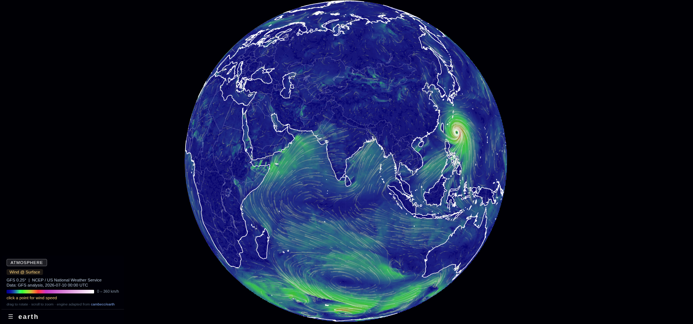

# earth



A minimal replica of the meteorological visualization from
[earth.nullschool.net](https://earth.nullschool.net/).The core algorithms are ported from [cambecc/earth](https://github.com/cambecc/earth) (MIT):

- **GFS grid interpolation** — bilinear interpolation of u/v wind components on a 0.25°×0.25° global grid
- **Projection distortion** — wind vectors are warped by the orthographic projection's local derivatives, so particle motion looks correct everywhere on the globe
- **Sinebow overlay** — the globe surface is colored by wind speed using earth's extended sinebow color scale (0–100 m/s), pastelized 22% toward white (the raw sinebow's saturated storm band renders brown over a dark map; nullschool's modern palette is lighter)
- **Particle animation** — thousands of particles advected through the field, drawn as fading grayscale trails bucketed by intensity


## Project structure

```
.
├── vercel.json                  # points Vercel's output at public/, sets cache headers
├── README.md
├── start.sh                     # local launcher: serves public/ on :8420 and opens browser
├── scripts/
│   ├── refresh_wind.py          # GFS data refresh, pygrib-based (verified working)
│   ├── refresh_ocean.py         # CMEMS ocean-current refresh via copernicusmarine toolbox (creds: .env/)
│   ├── refresh_waves.py         # GFS-Wave (WAVEWATCH III) waves refresh via NOMADS, anonymous
│   └── upload_data.sh           # ships public/data/current-*.json to the Cloudflare R2 bucket (creds: .env/r2)
└── public/                      # the deployable site (code + static assets only)
    ├── index.html               # four stacked canvases (#map, #overlay, #lines, #animation) + burger-menu HUD
    ├── css/styles.css           # dark theme, bottom-left HUD bar + expandable menu panel
    ├── js/wind.js               # the whole engine (~1150 lines, no build step)
    ├── js/menu.js               # burger-menu toggle, tab switching, layer-change dispatch (~40 lines)
    ├── libs/
    │   ├── d3.v7.min.js         # vendored D3 v7
    │   └── topojson-client.min.js
    └── data/
        ├── current-*.json       # 12 weather datasets — GIT-IGNORED since 2026-07-12 (data/code
        │                        #   split): refresh scripts write them here for local dev,
        │                        #   upload_data.sh ships them to Cloudflare R2 for production;
        │                        #   js/wind.js picks local vs R2 by hostname (see Data section)
        ├── earth-topo.json      # Natural Earth coastline/lake topology (50m + 110m) — in git
        ├── countries-50m.json   # world-atlas@2 countries topology (political borders, idle detail)
        └── countries-110m.json  # world-atlas@2 countries topology (borders while dragging)
```

The 12 weather files and their shapes (all grib2json format, ~97 MB total): 4× GFS u/v wind
(`current-wind-{surface-level,1000hpa,500hpa,10hpa}-gfs-0.25.json`, ~9–10 MB each), 3× GFS 2 m
scalars (`current-{temp,rh,dewpoint}-surface-level-gfs-0.25.json`, ~5–6 MB), 2× CMEMS current
u/v at 0.494 m / 25.211 m (`current-ocean-currents{,-25m}-cmems-0.25.json`, ~11 MB), CMEMS
thetao (`current-ocean-temp-cmems-0.25.json`, ~6 MB), GFS-Wave propagation u/v with |v| =
peak period (`current-ocean-waves-gfswave-0.25.json`, ~10 MB) and significant wave height
(`current-ocean-wave-height-gfswave-0.25.json`, ~5 MB).

## How it works (rendering pipeline in `js/wind.js`)

1. **Load** — fetches the wind JSON and three topologies in parallel; `buildGrid()` indexes the
   two GFS records (u: parameterCategory 2 / parameterNumber 2, v: 2/3) into a 1440×721 grid with
   a duplicated wrap-around column, exposing `interpolate(λ, φ)` (bilinear; grid geometry is read
   from the header, so any regular lat/lon resolution works). Rows are flat Float32Arrays
   ([u0, v0, u1, v1, …]) — at 0.25° the grid exceeds 1M cells and per-cell JS arrays would cost
   hundreds of MB. Political borders are derived with
   `topojson.mesh(countries, (a, b) => a !== b)` — internal boundaries only, coastlines excluded.
2. **Map layers** — orthographic projection (`d3.geoOrthographic`, clip angle 90°). Sphere fill
   and graticule draw on `#map` *below* the color overlay; coastlines (1.6 px, full white),
   country borders and lakes draw on `#lines` *above* it — beneath the 0.72-alpha overlay the
   outlines dimmed to ~30% and vanished behind the trails. Uses 110m geometry while dragging,
   50m when idle. Both rendered at devicePixelRatio for crisp lines.
3. **Mask** — the sphere is filled with a sentinel color (magenta, unreachable by the sinebow
   scale) on an offscreen canvas; its imageData tells the interpolator which pixels are on the
   globe (alpha > 0) and later doubles as the overlay image.
4. **Field interpolation** — for every 2nd pixel of the visible globe: invert-project to (λ, φ),
   sample the wind, distort the vector by the projection's finite-difference derivatives
   (velocity scale = `bounds.height / 60000`), and store a screen-space motion vector per pixel
   ("columns"). Simultaneously the pixel's overlay color is written into the mask imageData using
   the extended sinebow scale at alpha 0.5. Runs in cooperative batches (100 ms work / 25 ms
   yield) so the UI never freezes; progress is shown in the HUD. On completion, leftover sentinel
   pixels at the antialiased rim are erased, then the imageData is blitted to `#overlay`.
5. **Particle animation** (`#animation` canvas) — `width × 10 × min(dpr, 2)` particles (×0.75 on
   mobile), each advected by the field vector at its pixel, respawned after 100 frames or when it
   exits the globe. The canvas is devicePixelRatio-scaled and strokes are 1 *device* px wide
   (`PARTICLE_LINE_WIDTH / dpr`) for fine nullschool-like trails. Trails fade via a
   `destination-in` fill of `rgba(0,0,0,0.97)` per frame (slower fade → long fluid streamlines);
   segments are bucketed into 13 near-neutral intensity styles (130→255, r×0.90/b×0.92, alpha
   0.70→0.50 falling with speed; grayscale 85→255 opaque in the original). Strokes are almost
   white on purpose: the hue comes from the overlay bleeding through (pink over the red eyewall,
   pale green over green) — a stronger green stroke tint muddied red zones into brown. Max
   intensity at 25 m/s; one `beginPath` per bucket.
   25 fps (`setTimeout`, 40 ms), matching the original. A **streak guard** respawns any particle
   whose per-frame move exceeds what the dataset's max wind speed can produce at the current
   zoom (×2 slack) — see [Fixed bugs](#fixed-bugs) for the sizing.
6. **Interaction** — drag rotates (sensitivity 75/scale °/px, φ clamped to ±90°), wheel zooms
   (0.5×–8× of the fitted scale), click reads wind speed at a point via `projection.invert` +
   `grid.interpolate`. Any manipulation cancels the current field/animation via a shared cancel
   token and hides the particle trails; while the pointer moves, `drawOverlayPreview()` repaints
   the color field **live at low resolution** (every 5th px, throttled to ~25 fps, upscaled with
   canvas smoothing) so the "smudged" overlay tracks the rotating/zooming globe outline exactly,
   like nullschool. A 200 ms debounce after release triggers the full recompute, whose
   `putImageData` replaces the preview wholesale. Window resize does the same, preserving
   relative zoom. Note: the preview must mask off-disc pixels **by radius** — d3-geo clamps
   `asin`, so `projection.invert` returns finite mirrored coordinates outside the globe.

### Key constants (top of `wind.js`, values taken from the original)

| Constant | Value | Meaning |
|---|---|---|
| `OVERLAY_ALPHA` | 0.72 × 255 | overlay transparency (0.4 in the original; near-opaque like nullschool) |
| `MAX_PARTICLE_AGE` | 100 | frames before a particle respawns |
| `PARTICLE_MULTIPLIER` | 3.5 | particles per pixel of globe width (7 in the original), further × min(dpr, 2); low → fewer, thicker, distinct traces |
| `FRAME_RATE` | 40 ms | ~25 fps animation |
| `MAX_INTENSITY` | 25 m/s | wind speed of brightest particle trail (17 in the original; higher cap keeps storm bands from saturating white) |
| `VELOCITY_SCALE` | 1/42000 | particle screen speed per m/s (× globe height × zoom factor below) |
| `ZOOM_SPEED_EXPONENT` | 0.6 | speed ∝ (initialScale/scale)^0.6: grows gently with zoom (~2× at 6×) — 1.0 made all tracks short/sparse, 0 made close-ups frantic |

(`PARTICLE_LINE_WIDTH` is 1.8 device px. **Particle screen speed is partially zoom-normalized**
via `ZOOM_SPEED_EXPONENT` — full normalization (exponent 1) made every track short and sparse,
no normalization (exponent 0) made close-ups a frantic white blaze that overshot the eyewall
vortex; 0.6 grows speed gently with zoom and `MAX_PARTICLE_STEP` (12 px) backstops stability.
The streak guard uses the same zoom factor. The streak-guard threshold is no longer a constant — it's computed per view from the dataset's
max wind speed and the projection scale; see [Fixed bugs](#fixed-bugs). Particle screen speed
deliberately grows with zoom — real-world physics seen closer up — and the guard scales the
same way. Trail strokes use the 100→255 tinted ramp at flat 0.55 alpha and fade by
0.97/frame — long fluid streamlines. Two de-whitening ramp experiments (ceiling 220,
speed-dependent alpha 0.6→0.35) were tried and **reverted by user preference**: the brighter
eyewall is accepted in exchange for the luminous long-streamline look.)


## Data

**Data/code split (2026-07-12)**: the `current-*` weather JSONs are **not in git**. The
refresh scripts still write them to `public/data/` (now git-ignored) so local dev works
exactly as before; production serves them from a **Cloudflare R2 bucket** instead. In
`js/wind.js`, every weather-file URL goes through `DATA_ROOT`, resolved once at load:
a `#data=<url>` hash override (for testing a bucket before wiring it in — e.g.
`#layer=waves&data=https://bucket.example/`) → local `data/` when served from
localhost/127.x/file: → `R2_DATA_ROOT` (a constant at the top of the orchestration
section; **set it to the bucket's public base URL after creating the bucket**). The three
topology files stay in the repo and always load relative — they're static assets, not data.
`scripts/upload_data.sh` ships the 12 files to R2 (S3-compatible API via the AWS CLI,
`--cache-control max-age=1800`; Cloudflare's edge gzips JSON on the fly). Consequences:
data refreshes no longer create commits, force-pushes, or Vercel deploys — the repo carries
no history churn and Vercel only redeploys on code pushes. Both paths verified headlessly:
localhost serving from `data/`, and a cross-origin CORS stand-in bucket via `#data=`.
Full R2 + Vercel + GitHub Actions recipe: `~/Documents/earth-vercel-deploy.md`.

`current-wind-surface-level-gfs-0.25.json` holds GFS 10 m surface wind (u/v,
0.25°×0.25°, values rounded to 0.1 m/s; ~9.2 MB raw / ~2.5 MB gzipped at the edge) in grib2json
format. **Last refreshed: GFS analysis 2026-07-11 12:00 UTC (all seven GFS datasets, one
cycle).** Note the data is a static snapshot — it only advances when
`refresh_wind.py` runs; the planned GitHub Action (see Next steps) is what will make "most
recent by default" true unattended. Upgraded 1° → 0.5° → 0.25°
(nullschool's resolution) on 2026-07-10 for aesthetic parity; before that it was the 2014-01-31
sample shipped with cambecc/earth. The HUD's "Data:" line always shows the loaded snapshot's
timestamp.

Three pressure-level datasets (added 2026-07-10, all GFS analysis 2026-07-10 06:00 UTC) sit
beside it: `current-wind-{1000hpa,500hpa,10hpa}-gfs-0.25.json` — UGRD/VGRD on isobaric
surfaces via the same filter CGI (`lev_1000_mb`/`lev_500_mb`/`lev_10_mb`). The engine's
`LAYERS` registry maps menu layer ids to these files; `buildGrid()` is level-agnostic
(records are picked by parameterCategory/Number only) and the data-driven streak guard and
color scale absorb the much faster jet-stream (500 hPa) and polar-night-jet (10 hPa) winds
with no per-level tuning.

Three **scalar overlay datasets** (added 2026-07-10, same 06z cycle) drive the combined
layers: 2 m TMP / RH / DPT as single-record grib2json files
(`current-{temp,rh,dewpoint}-surface-level-gfs-0.25.json`). A combined layer pairs surface
wind (particle trails) with a scalar field colored through a d3-scale-chromatic colormap LUT
(the vendored D3 bundle ships them, except bwr — hand-rolled two-segment ramp):
**Temperature → matplotlib 'bwr' diverging (263.15–318.15 K = -10–45 °C, user-revised
2026-07-12 from the ±50 °C symmetric domain; out-of-range pins to the end colors, white
midpoint at 17.5 °C), Relative humidity → BuPu
(0–100 %), Dew point → PuBuGn (233.15–308.15 K)**. Colormap history (all user-directed,
same day): temperature inferno → reversed inferno → YlOrRd (0–50 °C floor — a -40 floor
pushed everything visible into red) → bwr; RH Purples → BuPu for contrast. The scale bar and the
click readout follow the active layer (`overlaySpec.format`; scalar value · wind speed).

The **ocean currents layer** (`feature/OceanCurrent`, 2026-07-12) reads
`current-ocean-currents-cmems-0.25.json`: a 2-record u/v file in the same grib2json format,
from **CMEMS Global Ocean Physics Analysis & Forecast**
(`cmems_mod_glo_phy-cur_anfc_0.083deg_P1D-m`, daily mean, 0.494 m depth, 1/12° strided ×4 to
¼°) via `scripts/refresh_ocean.py` + the `copernicusmarine` toolbox. The layer has no second
scalar file — a `fromMagnitude` overlaySpec colors the sea by current speed itself through
cambecc's segmented ocean palette (deep blue 0 → green 0.4 → sand 0.65–1.0 → red 1.5 m/s),
and per-layer `particles` tuning (`velocityScale` 1/2500 ≈ 17× wind, `maxIntensity` 1 m/s —
the data-driven streak guard scales along) makes the ~50×-slower currents visibly crawl.
CMEMS land cells are null → land stays uncolored and particle-free for free.
**Last refreshed: CMEMS daily mean 2026-07-11** (real credentialed fetch; an earlier
CoastWatch ERDDAP stand-in used for pre-login verification has been replaced).
Nullschool-parity rendering (2026-07-12, from the user's side-by-side screenshots): land is
charcoal `#333338` — `topojson.merge`d country polygons filled on the `#lines` canvas *above*
the overlay, so the vector coastline crops the grid staircase; `buildGrid`'s bilinear is
NaN-tolerant (hole corners drop out, weights renormalize) so sea color reaches the last valid
cell instead of retreating half a cell from every coast; the ocean overlay renders dimmer
(alpha 0.58 vs 0.72) so the calm ocean stays near-black and the trails (multiplier 4, line
width 1.7 device px, velocityScale 1/1700, intensity saturating at 0.7 m/s — user-matched
against live nullschool) read as the currents. Trails cannot spill onto land: `#lines` sits
above `#animation`, so the opaque land fill crops them at the vector coastline. Water
without current data (Caspian, Aral, coastal grid holes) renders `NO_DATA_GRAY` — the same
charcoal as land — rather than a black hole.

The **sea water temperature layer** (`feature/SeaWaterTemperature`, 2026-07-12) pairs the
currents-driven particles with a thetao scalar overlay
(`cmems_mod_glo_phy-thetao_anfc_0.083deg_P1D-m`, °C at 0.494 m, same ¼° grid) through the
same bwr diverging colormap as the Atmosphere temperature layer, domain **0–35 °C** (user's
spec, revised same day from 0–50; values outside pin to the end colors via the clamped LUT
index — the white midpoint sits at 17.5 °C so tropical water reads warm-red).
`refresh_ocean.py` is parameterized like `refresh_wind.py`: `currents` / `currents25`
(u/v at 0.494 m / 25.211 m) and `temperature` (thetao) products, each with a `depth`
bracket; its `coarsen()` samples every 3rd point (1/12° → ¼°, atmosphere-grid parity) and
fills land-sampled points from the surrounding 7×7 full-res window so the data's coast hugs
the vector one (kills the charcoal staircase in the sea; tightened twice on user review —
the first pass at ⅓° + 5×5 still left single-cell nubs on convoluted coasts).
**Depths**: both CMEMS datasets carry **50 depth levels**
(0.494, 1.54, 2.65, 3.82, 5.08, 6.44, 7.93, 9.57, 11.4, 13.5, 15.8 … 55.8 … 109.7 … 453.9 …
1062 … 5727.9 m); we render the shallowest (0.494 m). Deeper layers only need
`minimum_depth`/`maximum_depth` changed in `fetch()` plus a LAYERS entry.

The **wave layers** (`feature/OceanWaves`, 2026-07-12) come from **GFS-Wave** — the
WAVEWATCH III model coupled into GFS (nullschool's credited source for its waves modes) —
via the same anonymous NOMADS filter CGI as the atmosphere (`filter_gfswave.pl`, file
`gfswave.t{hh}z.global.0p25.f000.grib2`, **no login needed**), through
`scripts/refresh_waves.py` (same newest-cycle walk-back as `refresh_wind.py`). One download
of HTSGW + PERPW + DIRPW yields two files: `current-ocean-waves-gfswave-0.25.json` holds u/v
**propagation vectors whose magnitude is the peak period in seconds** (DIRPW is the
meteorological "direction from" — verified against the Southern Ocean westerlies, median
265° — so propagation = from + 180°); the period overlay is then just `fromMagnitude` and
the click readout speaks seconds, no third file. `current-ocean-wave-height-gfswave-0.25.json`
is the HTSGW scalar. Both fields get a 5×5 NaN-dilation pass at native 0.25° (the wave
model's land mask is a cell fatter than the vector coastline — same staircase bug as CMEMS,
same cure). Since the third redesign round (user spec) there is **one combined Waves layer**
(`waves`, like nullschool): the background colors by significant wave height through a
**blue → light blue → yellow → orange → saffron** ramp (0–15 m; >15 m clips to saffron via
the clamped LUT index), and the click readout speaks both fields ("4.2 m · 12.3 s"). The
particles are **crest dashes, not trails** (user spec against a zoomed nullschool shot):
`animate()` grew per-layer `maxAge`/`fade` and a `crestLength` mode that strokes an oriented
dash PERPENDICULAR to travel through the segment midpoint — dense flickering crest rows
**barely creeping** (velocityScale 1/360000 — waves are localized and far slower than winds;
history 1/12000 → ×0.10 → ×⅓) and dying fast (maxAge 12, fade 0.6, multiplier 3, width 2.5;
crest half-length 4.5 px scaled by the intensity bucket). `brightnessFloor: 40` widens the
particle brightness ramp (default floor 130), so faster long-period swell draws markedly
brighter crests than slow chop — deep-water phase speed grows with period, so
period-brightness *is* speed-brightness.

**CMEMS credentials**: `scripts/refresh_ocean.py` needs a Copernicus Marine account. The
toolbox reads `COPERNICUSMARINE_SERVICE_USERNAME` / `COPERNICUSMARINE_SERVICE_PASSWORD` —
locally these live in the git-ignored `.env/copernicusmarine` (run
`set -a && source .env/copernicusmarine && set +a` before the script); in CI they become
GitHub Actions repository secrets. Anonymous access does not work (the ARCO zarr store 403s
every data chunk).

To refresh (preferred path, verified working — no Java needed):

```sh
python3 -m venv gribenv && ./gribenv/bin/pip install pygrib
./gribenv/bin/python scripts/refresh_wind.py            # surface (10 m) wind
./gribenv/bin/python scripts/refresh_wind.py 500hpa     # or: 1000hpa, 10hpa
./gribenv/bin/python scripts/refresh_wind.py temperature  # or: rh, dew (2 m scalars)
```

The script finds the newest published GFS cycle on NOMADS (walking back 6 h at a time — cycles
appear ~4–5 h after their nominal time), downloads only the 10 m UGRD/VGRD fields via the grib
filter CGI (`filter_gfs_0p25.pl`, file `gfs.t{hh}z.pgrb2.0p25.f000`; NB the 0.5° product is
named `pgrb2full.0p50`, the 0.25° one plain `pgrb2`), decodes with pygrib, and overwrites the
JSON in place. Pass a local `.grib2` path as an argument to skip the download. Grid geometry
(nx/ny/dx/dy) is derived from the GRIB, and `buildGrid()` reads it from the header, so any
regular lat/lon resolution works end-to-end.

Gotchas learned the hard way:

- The **`.anl` files do not expose 10 m winds** through the filter CGI (returns
  "data file is not present"). Use **`f000`** of the newest cycle instead — it's the
  analysis-hour forecast, effectively identical.
- A cycle's directory can exist on NOMADS before its grid files do; the script's fallback
  handles this (e.g. it skipped an empty 00z and used the previous day's 18z).

`public/data/earth-topo.json` is Natural Earth coastline/lake topology (50m + 110m), from
cambecc/earth. `countries-{50m,110m}.json` are vendored from
[world-atlas@2](https://github.com/topojson/world-atlas) (Natural Earth derived) for political
borders.

## Fixed bugs

- **Streaking lines across the globe** (fixed & verified 2026-07-10): thin straight chords
  appeared over the disc, drawn by the particle animation. Root cause: the finite-difference
  projection distortion **diverges at the globe's limb** (not just the poles) — headless
  instrumentation showed screen-space vectors of 170–2400 px/frame originating exclusively at
  rim pixels (~90° from the view center), which were stroked as straight lines when they landed
  back on the disc. Fix: `evolve()` in `wind.js` respawns any particle whose per-frame move
  exceeds the streak-guard threshold (see next entry for how that threshold is sized).
- **Missing trails in high-wind areas when zoomed in** (fixed & verified 2026-07-10): the first
  streak-guard threshold was a fixed screen distance (`max(10 px, 2% of globe height)`), but a
  particle's legitimate per-frame move grows with zoom (∝ projection scale). At ~5×+ zoom a real
  35–40 m/s eyewall wind moves 20–40 px/frame and was killed as a "streak", leaving a dead
  annulus with no trails exactly over the red high-speed zone of the typhoon. Fix: the guard is
  now sized from the data — `buildGrid()` records the dataset's max wind speed, and the
  threshold is `max(10 px, 2 × maxSpeed × bounds.height × VELOCITY_SCALE × px-per-degree)`,
  where px-per-degree = `projection.scale() × π/180`. Legit fast wind passes at any zoom; limb
  artifacts (5–100× beyond it) are still caught. Reproduced and verified headlessly at 8× zoom
  via the `#rotate=-128.5,-21.5&zoom=8` URL hash; default view re-verified streak-free.
- **Stray red sentinel pixels on the antialiased rim** (fixed earlier): the cleanup pass at the
  end of `interpolateField()` erases leftover magenta sentinel pixels. Verified clean in the
  2026-07-10 screenshots.
- **Frozen overlay misaligned during drag/zoom** (fixed 2026-07-10): the first freeze-frame
  implementation left the stale overlay static while the map outline rotated/scaled beneath it,
  so the color disc visibly detached from the globe (wrong size while zooming, wrong hemisphere
  while dragging). Fix: live low-res overlay preview during manipulation (see pipeline step 6).
  First attempt painted a colored square around the globe because `projection.invert` returns
  finite coordinates for off-disc points (d3-geo's clamped asin) — masked by radius check.
  Verified by headless screenshot of the preview pass: clean disc, aligned with coastlines,
  visually near-identical to the full-res overlay.
- **Stale data/engine after refresh** (fixed 2026-07-10): after refreshing the wind JSON and
  fixing wind.js, a plain browser reload still showed the 2014 date and the streaks. Chrome's
  normal reload only revalidates the HTML document — the `<script>` and `fetch()`ed JSON follow
  heuristic caching and were served stale from disk cache. The data fetches use
  `{cache: "no-cache"}` so they revalidate on every load (cheap 304 when unchanged). A `?v=`
  cache-busting scheme on the script tag was used during heavy iteration and later removed for
  simplicity (user preference) — after editing wind.js, view changes with a hard reload
  (Ctrl+Shift+R).

## Aesthetic-parity pass

- **Done & verified** (headless Chromium screenshots): 0.5° data renders with red typhoon
  eyewall + bright core, political borders, finer/dimmer particle trails, brighter overlay;
  no streaks; no rim artifacts; no console errors; HUD reads "GFS 0.5°" and the current run's
  date. Post-change metrics vs the nullschool reference screenshot: brightness 0.52 (target
  0.53), red-tint pixels 360 (reference 179, previously 0).
- **Human-verified**: drag freeze-frame behavior (user confirmed it matches nullschool).
  Follow-up fix the same day: the overlay now re-projects live at low resolution during
  drag/zoom so it tracks the globe outline instead of sitting frozen and misaligned; the
  preview render itself is headless-verified, the drag feel needs one more human pass.

- **Baseline measurement**: saturation already matched (0.71 theirs / 0.69 ours); 
  theirs was brighter (0.53 vs 0.46) with 179 red eyewall pixels vs our 0, and finer/denser trails. 

  All four gaps were closed:

   - **Red tints at intense wind** — was a *data resolution* issue, not a color-scale issue: the
   scale's red band lives at ~35–45 m/s and the 1° grid smoothed the typhoon eyewall to
   38.9 m/s. **Done:** data upgraded to 0.5° (peak 40.5 m/s → red ring + bright core verified
   in a zoomed crop).
   - **Trail texture** — ours was sparser/chunkier (fat CSS-px strokes, ramp maxing white at
   17 m/s). **Done:** `#animation` canvas is dpr-scaled with 1-device-px strokes, particle
   count ×10 multiplier ×min(dpr, 2), ramp floor 85→64, fade 0.97→0.96. Second pass
   (user-requested): trail ramp tinted green and `VELOCITY_SCALE` raised 1/60000→1/40000 for
   nullschool-like motion speed; the streak guard scales with `VELOCITY_SCALE`, so both bug
   fixes hold automatically. Third pass (user comparison at matched zoom): multiplier 10→6 and
   fade 0.96→0.97 (fewer, longer, fluid streamlines instead of dense fur), ramp floor 64→100
   (slow-wind trails bright and distinct, not dark-gray mush), tint deepened to r×0.78/b×0.82,
   `OVERLAY_ALPHA` 0.5→0.55 (leaf-green field dominates over the trails).
   - Overlay luminance** — **done:** `OVERLAY_ALPHA` 0.4→0.5 (measured brightness now 0.52 vs
   target 0.53).
   - **Political borders** — **done:** vendored world-atlas countries topologies;
   `topojson.mesh(…, (a, b) => a !== b)` draws internal boundaries at 0.25 alpha.
   - **Fourth pass** (user comparison): trail alpha 1.0→0.85 (overlay bleeds through trails —
   red eyewall stays visible), data upgraded 0.5°→0.25° (nullschool's resolution; grid rows
   refactored to Float32Arrays to keep memory sane), graticule alpha 0.07→0.12 (their visible
   lat/lon mesh).
   - **Fifth pass** ("cyclone too white", measured): in the eyewall ring 10.8% of our pixels
   were white-ish vs nullschool's 0.0%. First fix used short dashes + zoom-normalized speed
   (0.2% white), but the user preferred the long streamlines and physical zoom-scaled speed,
   so the **sixth pass** restored fade 0.97 / age 100 / zoom-growing velocity (streak guard
   re-scaled to match). Two further ramp experiments (ceiling 255→220, then speed-dependent
   alpha 0.6→0.35; measured 3.9% and 2.1% white cover) were **reverted — the user preferred
   the brighter long-streamline look** (flat 0.55 alpha, full 100→255 ramp, ~4.8% white in the
   eyewall crop). Final aesthetic: luminous fluid streamlines; nullschool's 0% white comes from
   short dashes, deliberately not adopted.

## HUD / burger menu (2026-07-10)

The bottom-left HUD is collapsed by default to a slim bar (`☰ earth` + transient
status line; page/HUD title is plain "earth", per user request). The burger button expands `#menu-panel` upward, nullschool-style, containing:

   - **Tabs** — hierarchical and exclusive: one top-level domain active at a time, and each
     domain displays exactly **one** layer (unlike nullschool, layers are never combined).
     Atmosphere holds seven layers: four wind layers (**Surface (10 m), 1000 hPa, 500 hPa,
     10 hPa** — wind-speed sinebow overlay) and three combined layers (**Temperature,
     Humidity, Dew Point** — surface-wind particle trails over a 2 m scalar field with
     inferno / Purples / PuBuGn colormaps; scale bar and click readout switch with the
     layer). Buttons carry `data-layer` ids matching the `LAYERS` registry in `wind.js`; clicking
     dispatches a `layerchange` CustomEvent, and `loadLayer()` in the engine swaps the
     dataset, restarts the pipeline, and syncs the active-button state (single source of
     truth) — including revealing the tab that owns the layer when booting via the hash.
     `#layer=<id>` in the URL hash selects the initial layer (also the headless-testing
     hook, since the menu needs a click). Since 2026-07-12 the domains **stack vertically**
     (`#tabs` is a column; each tab header sits directly above its own `.tab-body`): the
     **Ocean tab** below Atmosphere holds **Current-Surface** (`data-layer="ocean"`),
     **Current-25m** (`data-layer="ocean25"`), **Temperature** (`data-layer="sst"`) and
     **Waves** (`data-layer="waves"`, the combined height + direction/period map), all live.
   - Data source + snapshot date lines, the color-scale bar, the click-for-wind-speed
     readout, and credits — all IDs (`#scale`, `#data-date`, `#location`, `#status`)
     unchanged, so `wind.js` needed no edits; `#status` lives in the always-visible bar so
     load progress/errors show while collapsed.

Logic lives in `js/menu.js` (plain JS, ~30 lines). CSS gotcha encountered: `.tab-body` uses
`display: flex`, which beats the HTML `hidden` attribute's UA-stylesheet `display: none` —
hence the explicit `.tab-body[hidden] { display: none; }` rule. Headless verification: the
burger can't be clicked headlessly; screenshot the open state by temporarily removing the
`hidden` attribute from `#menu-panel` (and restore it).

## Next steps

   - **Ocean currents — DONE (2026-07-12, `feature/OceanCurrent`).** Real CMEMS data via
     the user's credentials in `.env/copernicusmarine`; nullschool-parity pass (charcoal
     land fill, NaN-tolerant bilinear, dim overlay + dense hairline trails) verified against
     the user's side-by-side screenshots; atmosphere layers regression-checked.
     **Data-access facts** (previous session's note was wrong): the CMEMS ARCO zarr is
     *not* fully anonymous — `.zmetadata` and coordinate chunks GET fine, but every data
     chunk (`uo/{t}.0.0.0` etc.) returns **403**, verified across chunk indices and both
     dimension separators. Hence the credentialed toolbox. Store facts that remain true:
     time = hours since 1950-01-01, daily means incl. ~8 forecast days (script picks newest
     day ≤ today); depth idx 0 = 0.494 m; uo/vo float32 m/s, no scale/offset; land = NaN;
     lat −80..90 (flip north-first for scan mode 0). Dead ends: NOMADS has no RTOFS filter,
     RTOFS 2ds is netCDF-only, NOMADS OPeNDAP retired (SCN 25-81), OSCAR/jplOscar stale.
     Working fallback: NOAA CoastWatch ERDDAP `noaacwBLENDEDNRTcurrentsDaily` (0.25° blended
     geostrophic; `.ncoJson` + stride; needs curl — python-urllib UA gets 403).
   - **Sea water temperature — DONE (2026-07-12, `feature/SeaWaterTemperature`)**: thetao
     scalar over currents-driven particles, bwr 0–50 °C per user spec. Possible follow-up:
     **depth-level layers** — both CMEMS datasets have 50 depths (0.494 m … 5727.9 m; e.g.
     15.8 m, 109.7 m, 453.9 m are natural picks); `fetch()`'s minimum/maximum_depth plus a
     LAYERS entry per depth is all it takes.
   - NB the venv (pygrib/PIL/numpy/copernicusmarine) lives in the session scratchpad under
     /tmp — likely wiped by reboot; recreate with `python3 -m venv gribenv && ./gribenv/bin/pip
     install pygrib pillow numpy copernicusmarine`.
   - Automate data refresh: a GitHub Action running `scripts/refresh_wind.py` +
     `refresh_waves.py` (anonymous) and `refresh_ocean.py` (CMEMS secrets), then
     `scripts/upload_data.sh` straight to the R2 bucket — **no commits, no Vercel
     redeploys** (data/code split, 2026-07-12). Cadence: **once daily by default**
     (user spec, 2026-07-12 — matches CMEMS's actual update rate); the repo variable
     `REFRESH_CADENCE=6h` switches all datasets to the old 6-hourly cadence without a
     workflow edit (a gate job filters the 6-hourly cron firings). Remaining one-time
     setup on the user's side: create the R2 bucket + public URL, set `R2_DATA_ROOT`
     in `wind.js`, add the five Actions secrets (+ the optional cadence variable).
     The full step-by-step guide (R2 bucket, CORS, secrets, ready-to-paste workflow
     YAML) lives at `~/Documents/earth-vercel-deploy.md` (deliberately outside the
     repo, 2026-07-12).
   - Touch pinch-zoom (only wheel zoom is implemented). A read-only URL-hash initial view
     already exists (`#rotate=λ,φ&zoom=k`, e.g. `#rotate=-128.5,-21.5&zoom=5` centers the
     typhoon; also the headless-testing hook) — writing the hash back on interaction like the
     original remains open.

## Version control / Feature deployment structure

Agreed branching model for growing the project beyond surface wind. **Executed 2026-07-10**
for the pressure-level wind layers: `refactor/layer-engine` merged first (`LAYERS` registry +
`loadLayer()` + per-level refresh script), then `feature/wind-1000hpa`, `feature/wind-500hpa`
and `feature/wind-10hpa` — each branched off updated `main` sequentially, verified headlessly
via the `#layer=<id>` hash before merging with `--no-ff`.

- **`main` is the only long-lived branch**, always deployable. Vercel's production deployment
  points at it. Everything else is short-lived: branch off `main`, build, merge, delete.
- **One short-lived feature branch per render**: `feature/ocean-currents`,
  `feature/ocean-temperature`. Vercel gives every branch a preview URL automatically, which
  fits the screenshot-based visual verification workflow — compare a branch's render against
  production side by side before merging.
- **Do the shared-engine refactor first, on its own branch (`refactor/layer-engine`), and
  merge it before starting either ocean layer.** `wind.js` currently hardcodes the wind
  layer; the engine must split into a shared core (projection, canvas stack, drag/zoom,
  overlay preview, menu wiring) plus per-layer modules (data source, color scale, particle
  vs. scalar rendering — ocean temperature is likely a pure overlay with no particles,
  unlike currents). If both ocean branches instead modify the monolithic `wind.js`
  independently, the second merge will be painful; after the refactor each feature branch
  touches only its own layer module.
- **Data refreshes never touch git at all** (since the 2026-07-12 data/code split — this
  resolved the old "keep data refreshes out of feature branches" rule and the repo-size
  worry in one move): the weather JSONs are git-ignored, refresh scripts update the local
  copies, and `upload_data.sh` ships them to the R2 bucket. Feature branches and `main`
  carry code only. NB: history from before the split still contains old data blobs; a
  one-time `git filter-repo` pass could shrink the clone if that ever matters.
- **Avoid** a `develop` branch or gitflow (pure ceremony at this scale) and long-lived
  parallel feature branches — the features share the engine, so divergence is the main risk
  and prompt merges are the cure.

## Changes

2026-07-12, on `main` (refresh cadence + quality pass + history cleanup):

- **Daily refresh by default** (was 6-hourly, applies to all datasets): the workflow in
  `~/Documents/earth-vercel-deploy.md` keeps a 6-hourly cron but a gate job only lets the
  ~00:45 UTC firing through unless the GitHub repo **variable** `REFRESH_CADENCE=6h` is
  set — toggling cadence is a settings-page change, no workflow edit.
- **Quality pass over `wind.js`**: `OCEAN_ALPHA` constant replaces the repeated
  `Math.floor(0.58 * 255)` in the ocean scalar specs; the wave-particle comment block
  rewritten to describe the final behavior instead of accreted was/now changelog (which
  lives here in Changes). Dead-code audit found none: every function and top-level
  constant in `wind.js`/`menu.js` and every script import is referenced.
- **History rewritten with `git filter-repo`** to drop the pre-split data blobs from
  all commits: `.git` went 49 MB → 1.9 MB; one pure data-refresh commit became empty and
  was pruned (47 → 46 commits). Force-pushed. Old clones must be re-cloned; all commit
  hashes changed.

2026-07-12, on `main` (data/code split — Cloudflare R2):

- **Weather data out of git**: the 12 `current-*.json` files are git-ignored and untracked
  (still written to `public/data/` by the refresh scripts for local dev). Production fetches
  them from a Cloudflare R2 bucket: `wind.js` routes every weather URL through `DATA_ROOT`
  (`#data=` hash override → local on localhost → `R2_DATA_ROOT` constant, **placeholder until
  the bucket exists**). Topologies stay in the repo. New `scripts/upload_data.sh` (S3 API,
  AWS CLI, cache-control 1800 s). Refreshes now cause zero commits/force-pushes/redeploys.
- Verified headlessly on both paths: localhost → local files; `#data=http://127.0.0.1:8421/`
  → a CORS-enabled stand-in bucket on a second origin (temperature layer, flow + scalar).
- Deployment guide `~/Documents/earth-vercel-deploy.md` rewritten around R2 (bucket setup,
  public URL + CORS, five Actions secrets, upload workflow).

2026-07-12, on `main` (wave-dash lifecycle):

- **Softer crest lifecycle** — maxAge 12 → 20, fade 0.6 → 0.72: dashes were blinking in
  and out too fast (user feedback); they now ease in/out over a longer life, still without
  smearing thanks to the near-static march speed.
- **Vercel deployment guide** written to `~/Documents/earth-vercel-deploy.md` (kept outside
  the repo on purpose): Vercel project `earth` serving `public/`, GitHub Actions 6-hourly
  refresh workflow, CMEMS secrets as Actions repository secrets, repo-size strategy.

2026-07-12, on `main` (wave-layer redesign, third round — combined map):

- **One Waves layer** — `wavep` removed; the single `waves` map combines the height colormap
  with the direction/period crest dashes (nullschool-style), readout "m · s" on click.
- **Height colormap → blue → light blue → yellow → orange → saffron** (user spec), 0–15 m,
  higher values clipped to saffron; replaces white→gray→teal.
- **Speed-scaled brightness** — `windIntensityColorScale` gained a per-layer brightness
  floor (`brightnessFloor: 40` for waves vs default 130): faster (longer-period) waves draw
  markedly brighter crests.
- **Even slower march** — velocityScale 1/120000 → 1/360000; the crests barely move, as
  waves should against winds.

2026-07-12, on `main` (wave-layer redesign, user feedback on the first render):

- **Crest dashes** — wave particles now stroke an oriented dash **perpendicular to travel**
  (`crestLength` mode in `animate()`), march at **1/10th** the previous speed
  (velocityScale 1/120000) and die quickly (maxAge 12, fade 0.6): a flickering crest field
  like the user's zoomed nullschool screenshot, nothing like the wind traces.
- **Wave-height colormap → white → gray → teal** (user spec): silvery calm seas, deep-teal
  storm core; the navy→sand→orange first cut is gone.

2026-07-12, on `feature/OceanWaves`:

- **Wave layers** (`waves` / `wavep`) — GFS-Wave (WAVEWATCH III / NCEP / NWS, nullschool's
  source) significant wave height + peak wave period, via the anonymous NOMADS filter —
  **no login required** (checked before building; the user asked for no workarounds if one
  was). New `scripts/refresh_waves.py`; one flow file carries propagation u/v with
  |v| = period (s), so the period overlay is `fromMagnitude` and the readout speaks seconds.
- **Crest-dash particle style** — per-layer `maxAge` and `fade` in `particleOpts`: the wave
  layers draw short, sparse, thick dashes marching in the propagation direction (nullschool's
  waves look) instead of long streamlines; tuned against the user's reference screenshot
  (multiplier 2.2→1.5, maxAge 18→14, fade 0.80→0.75, width 2.6→2.9 after first render).
- **Coastal NaN-dilation** (5×5) in the wave converter — the wave model's land mask is a
  cell fatter than the vector coastline; pre-empts the charcoal-staircase bug the CMEMS
  layers hit. Atmosphere surface-wind layer regression-checked after the `animate()` change.

2026-07-12, on `main` (post-merge tuning, second round):

- **Deep-current level 110 m → 25 m** (user pick): layer id `ocean110`→`ocean25`, button
  **Current-25m**, data at the 25.211 m level (near the mixed-layer base) — product
  `currents25`, file `current-ocean-currents-25m-cmems-0.25.json`.
- **Atmosphere temperature domain -50–50 → -10–45 °C** (user spec): populated range gets
  the full bwr stretch, endpoints pin (same clamping as the ocean scale); the white point
  moves from 0 °C to 17.5 °C.

2026-07-12, on `main` (post-merge tuning):

- **Residual blockiness tuned away** (third user pass): ocean grids re-coarsened at
  **¼°** (stride 3 — atmosphere-grid parity) with a **7×7** NaN-fill window (±one output
  cell), replacing ⅓° + 5×5 whose single-cell charcoal nubs still showed on convoluted
  coasts. Data files renamed `…-cmems-0.25.json` (currents ~11 MB, thetao ~6 MB).

2026-07-12, on `feature/DeepCurrent`:

- **Current @ 110 m layer** (`ocean110`) — uo/vo at the 109.73 m level (below the mixed
  layer: the Equatorial Undercurrent and boundary-current cores, invisible at the
  surface). Menu buttons renamed **Current-Surface** / **Current-110m**; the two current
  layers share one `CURRENT_SPEED_SCALAR` spec; `refresh_ocean.py` products carry a
  `depth` bracket and the header's `surface1Value` reports the real level.
- **Coastal blockiness fixed in the data** (user bug report, ScreenshotSST): striding the
  1/12° grid marked a ⅓° cell "land" whenever its exact sample point was — a land mask a
  whole cell fatter than the vector coastline (charcoal staircase in the sea). `coarsen()`
  now fills land-sampled points with the mean of the surrounding 5×5 full-res window, so
  the data's sea reaches within one 1/12° cell of the real coast. All three ocean datasets
  regenerated.
- **SST domain 0–50 → 0–35 °C** (user spec): the ocean never gets hotter, so the red half
  of bwr was wasted; the white midpoint now sits at 17.5 °C and tropical water reads
  warm-red.

2026-07-12, on `feature/SeaWaterTemperature`:

- **Sea water temperature layer** (`sst`) — CMEMS thetao (°C, 0.494 m) as a scalar overlay
  under the currents-driven particles; bwr diverging 0–50 °C (same scheme as Atmosphere
  temperature; out-of-range pins to end colors). `refresh_ocean.py` parameterized into
  PRODUCTS (`currents` / `temperature`), Ocean tab's Temperature button live.
- **Ocean-layer generalizations** — dataless-water charcoal and the m/s click readout now
  key on the layer (`landFill` / `flowFormat`) instead of the currents-only
  `fromMagnitude` flag; shared OCEAN_* constants for file/credit/particles.
- **Depths explored**: both CMEMS datasets carry 50 levels, 0.494–5727.9 m (we use the
  shallowest); deeper layers need one `fetch()` parameter + a LAYERS entry.

2026-07-12, on `feature/OceanCurrent`:

- **Ocean currents layer** — new `ocean` entry in `LAYERS`: CMEMS surface currents drive
  both particles and a `fromMagnitude` speed overlay (segmented nullschool ocean palette,
  0–1.5 m/s); per-layer `particles` tuning (velocityScale/maxIntensity) and per-layer
  credit/date lines; click readout shows m/s. `segmentedLut()` added beside the colormap
  LUTs; grid continuity check `floor`→`round` (1080 × ⅓° is 359.99… in floats).
- **Vertical domain tabs** — `#tabs` is now a column with each tab header above its own
  layer row; Ocean sits below Atmosphere with live **Current** and a "Temperature soon"
  placeholder; `loadLayer()` also reveals the owning tab when booting from `#layer=…`.
- **`scripts/refresh_ocean.py`** — copernicusmarine-toolbox reader (1/12° → stride ×4 → ⅓°,
  grib2json output, land = null); credentials from the git-ignored `.env/copernicusmarine`.
  First real dataset (2026-07-11 daily mean) committed.
- **Nullschool-parity pass** (user screenshot comparison): charcoal `#333338` land fill
  above the overlay (crisp vector coasts instead of black land + blocky grid staircase),
  NaN-tolerant renormalizing bilinear in `buildGrid` (sea color reaches the coast), ocean
  overlay dimmed to alpha 0.58 with denser/finer trails (multiplier 7, width 1.2,
  saturation 0.7 m/s) so currents read as luminous streamlines over near-black ocean.
- **Ocean follow-up fixes** (user bug reports, same day): trail spill-over onto land ended
  by moving `#lines` above `#animation` in the canvas stack — the opaque land fill now crops
  trails at the vector coastline (the "boolean op" costs nothing); dataless water (Caspian,
  Aral, coastal grid holes) painted `NO_DATA_GRAY` = the land charcoal instead of black, in
  both the field and the drag preview; trails retuned to the confirmed nullschool character —
  faster, sparser, slightly thicker (velocityScale 1/2500→1/1700, multiplier 7→4, width
  1.2→1.7).

All of the below landed on 2026-07-10 (the project went from the stock cambecc/earth port to
its current state in one extended session):

- **Live data** — replaced the 2014-01-31 1° sample with current GFS analyses; resolution
  upgraded 1° → 0.5° → 0.25° (nullschool parity). New pygrib-based `scripts/refresh_wind.py`
  (no Java), later parameterized by level.
- **Bug fixes** (details under [Fixed bugs](#fixed-bugs)): limb-divergence streak chords;
  streak guard killing legitimate fast trails at zoom (data-driven threshold); hollow typhoon
  eye from Euler overshoot (`MAX_PARTICLE_STEP` 12 px); frozen overlay misaligned during
  drag/zoom (live low-res preview); stale browser cache (`no-cache` data fetches); rim
  sentinel pixels.
- **Aesthetic parity with nullschool** (measured passes, see
  [Aesthetic-parity pass](#aesthetic-parity-pass)): pastelized extended-sinebow overlay at
  0.72 alpha, near-neutral luminous long-streamline trails, deep-indigo calm end (≈#070570),
  political borders, dpr-crisp rendering.
- **Four-canvas stack** — dedicated `#lines` canvas above the overlay so coastlines render
  full-white and stay visible through the trails.
- **Burger-menu HUD** — collapsed `☰ earth` bar; expandable panel with hierarchical
  exclusive tabs (Atmosphere now; Ocean written but hidden until its pages are ready); the
  color bar, data lines and readouts all moved inside. Page title simplified to "earth".
- **Layer engine + pressure-level winds** — `LAYERS` registry, `loadLayer()`, `layerchange`
  event, `#layer=<id>` hash; three new GFS layers (1000 hPa, 500 hPa, 10 hPa @ 06z) delivered
  via `--no-ff` feature branches (`feature/wind-1000hpa`, `feature/wind-500hpa`,
  `feature/wind-10hpa`) per the branching model above, each verified headlessly pre-merge.
- **Scalar-overlay engine + combined layers** — `refactor/scalar-overlay` added
  `buildScalarGrid()`, d3-scale-chromatic colormap LUTs, `overlayColorAt()` dispatch (full-res
  field + drag preview), per-layer scale bar/label and click readout, and scalar products in
  the refresh script (2 m TMP/RH/DPT). Then `feature/Temperature` (inferno),
  `feature/RH` (Purples) and `feature/Dew` (PuBuGn) each paired surface-wind trails with
  their scalar overlay — same branch-verify-merge flow; surface wind data refreshed to 06z on
  `main` first so all layers share one GFS cycle.
- **Repo hygiene** — `__pycache__` ignored; `?v=` cache-busting removed for simplicity;
  README maintained as the cross-session handoff document; history pushed to GitHub.
  All work branches (4× wind, 3× scalar, 2× refactor) were deleted after merging — their
  history survives in the `--no-ff` merge commits; only `main` remains.