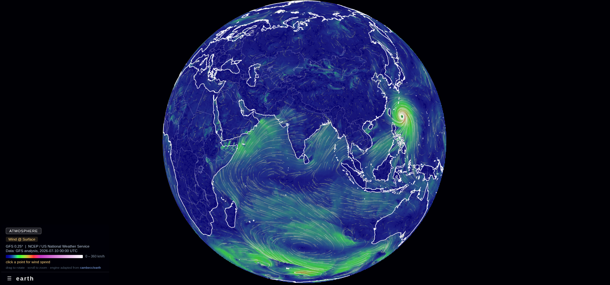

# earth



A minimal replica of the meteorological visualization at
[earth.nullschool.net](https://earth.nullschool.net/): an orthographic globe with a colored
scalar field and thousands of particles advected through a live vector field. Thirteen layers
across two domains (Atmosphere, Ocean) are driven by NOAA GFS, NOAA GFS-Wave and Copernicus
Marine (CMEMS) data.

The site is static — four stacked canvases, vanilla JS, vendored D3 v7 + topojson-client, no
build step, no framework. The core algorithms are ported from
[cambecc/earth](https://github.com/cambecc/earth) (MIT):

- **Grid interpolation** — bilinear interpolation of u/v components on a regular lat/lon grid
  (0.25°×0.25° globally), NaN-tolerant so fields with land holes reach their coastline.
- **Projection distortion** — flow vectors are warped by the orthographic projection's local
  derivatives, so particle motion looks correct everywhere on the globe.
- **Sinebow overlay** — the sphere is colored by wind speed through earth's extended sinebow
  scale (0–100 m/s), pastelized 22% toward white; the raw sinebow's saturated storm band
  renders brown over a dark map, while nullschool's modern palette is lighter.
- **Particle animation** — thousands of particles advected through the field, drawn as fading
  trails bucketed by intensity.

## Quick start

```sh
./start.sh            # serves public/ on http://localhost:8420 and opens a browser
```

Any static server works — `start.sh` is just
`python3 -m http.server 8420 -d public` plus an `xdg-open`.

Neither the fourteen weather datasets nor the RealView imagery is **in the git repo**
([Data](#data)). For a working local page, either populate `public/data/` — the weather JSONs via
[Refreshing the data](#refreshing-the-data), the imagery via a one-off `./scripts/fetch_textures.sh`
— or borrow the deployed bucket with the `#data=` hash below. The two are independent: without the
JSONs the Atmosphere and Ocean layers fail, without the imagery the RealView layers do.

All URL-hash options are read once at load and can be combined with `&`:

| Hash | Meaning |
|---|---|
| `#layer=<id>` | initial layer: `surface`, `1000hpa`, `500hpa`, `10hpa`, `temperature`, `rh`, `dew`, `ocean`, `ocean25`, `ocean110`, `ocean450`, `sst`, `waves`, `daylight`, `nightlights`, `relief` |
| `#rotate=λ,φ` | initial center, e.g. `#rotate=-128.5,-21.5` (φ clamped to ±90°) |
| `#zoom=k` | initial zoom, 0.5–8× the fitted scale |
| `#data=<url>` | fetch the weather JSONs *and the RealView imagery* from this base URL instead of local files / R2 |
| `#relief=k` | relief depth for the Relief layer, 0–1 (default 0.02). Read once at boot; `EarthRenderers.sunlight.setRelief(k)` in the console changes it live |

Without `#rotate=`, the globe opens centered on the visitor's country, inferred from the browser's
timezone with no permission prompt and no network request — see
[Initial view: timezone lookup](#initial-view-timezone-lookup).

The hash is **written back** as the view settles (on a layer change, and 200 ms after the last
drag, wheel or pinch), so the address bar always describes what is on screen and a copied URL
reproduces it. `history.replaceState` is used, so dragging does not fill the back button, and a
`#data=` override is carried through verbatim. Reading is still boot-only: editing the hash by
hand needs a reload to take effect.

`#layer=` and `#rotate=`/`#zoom=` are also the headless-testing hooks: the burger menu needs a
real click, and a specific view can otherwise only be reached by dragging.

After editing `wind.js`, `sunlight.js` or `menu.js`, reload hard (Ctrl+Shift+R) — there is no
cache-busting on the script tags. Data fetches use `{cache: "no-cache"}`, so refreshed datasets appear on a plain
reload.

Deployment: live at **[globe-climatesim.vercel.app](https://globe-climatesim.vercel.app)**. Vercel
serves `public/` (`vercel.json` sets `outputDirectory` and cache headers), the weather JSONs come
from a Cloudflare R2 bucket, and `.github/workflows/refresh-data.yml` refreshes them every six
hours without touching git ([Automated refresh](#automated-refresh)).

## Project structure

```
.
├── vercel.json                  # points Vercel's output at public/, sets cache headers
├── start.sh                     # local launcher: serves public/ on :8420, opens a browser
├── README.md
├── asset/view.png               # the screenshot above
├── .env/                        # git-ignored credentials: copernicusmarine, r2
├── .github/workflows/
│   └── refresh-data.yml         # 6-hourly refresh of all 14 datasets → R2 (no commits, no deploys)
├── scripts/
│   ├── refresh_wind.py          # GFS winds + 2 m scalars via NOMADS, pygrib (anonymous)
│   ├── refresh_ocean.py         # CMEMS currents + thetao via copernicusmarine (credentialed)
│   ├── refresh_waves.py         # GFS-Wave (WAVEWATCH III) height/period/direction (anonymous)
│   ├── upload_data.sh           # brotli-compresses public/data/current-*.json into the R2 bucket
│   ├── fetch_textures.sh        # ONE-OFF: downloads the NASA imagery the RealView layers use
│   ├── upload_textures.sh       # ONE-OFF: ships that imagery to R2 (never in the refresh loop)
│   └── gen_tz_centers.js        # regenerates public/js/tz-centers.js from tzdata + countries-50m
└── public/                      # the deployable site (code + static assets only)
    ├── index.html               # four stacked canvases (#map, #overlay, #animation, #lines) + HUD
    ├── css/styles.css           # dark theme, bottom-left HUD bar + expandable menu panel
    ├── js/wind.js               # the whole engine (~1480 lines, one IIFE)
    ├── js/sunlight.js           # renderer plug-in: the RealView layers (~730 lines)
    ├── js/menu.js               # burger toggle, tab switching, layerchange dispatch (~40 lines)
    ├── js/tz-centers.js         # GENERATED: timezone → country centroid, for the initial view
    ├── libs/
    │   ├── d3.v7.min.js         # vendored D3 v7 (includes d3-scale-chromatic)
    │   ├── suncalc.js           # vendored SunCalc v1.9.0 UMD (BSD-2-Clause), unmodified
    │   └── topojson-client.min.js
    └── data/
        ├── current-*.json       # the 14 weather datasets — GIT-IGNORED (data/code split):
        │                        #   refresh scripts write them here for local dev,
        │                        #   upload_data.sh ships them to Cloudflare R2 for production,
        │                        #   wind.js picks local vs R2 by hostname (see Data)
        ├── bluemarble-*.jpg     # 12 monthly Blue Marble NG composites — GIT-IGNORED, static:
        │                        #   fetch_textures.sh writes them, upload_textures.sh ships them
        ├── blackmarble-*.jpg    # VIIRS night lights — GIT-IGNORED, same lifecycle
        ├── elevation-gebco-*.png  # GEBCO elevation, for Relief — GIT-IGNORED, ditto
        ├── earth-topo.json      # Natural Earth coastline/lake topology (50m + 110m) — in git
        ├── countries-50m.json   # world-atlas@2 countries topology (borders + land, idle detail)
        └── countries-110m.json  # world-atlas@2 countries topology (borders + land, while dragging)
```

The topologies are static assets, not data: they stay in git and always load relative to the
page, never through the R2 root.

## How it works

Everything lives in `public/js/wind.js` — one IIFE, no modules, sectioned as color scales →
grids → projection → canvases → mask/field → drag preview → animation → HUD → orchestration →
boot. `public/js/menu.js` only translates clicks into events; the engine owns all state.

### Rendering pipeline

1. **Load** — `init()` fetches the three topologies in parallel, builds the meshes, then
   `loadLayer()` fetches the active layer's flow dataset (plus its scalar dataset, if any).
   `buildGrid()` indexes the two flow records (u: `parameterCategory` 2 / `parameterNumber` 2,
   v: 2/3) into a `nj`-row grid with a duplicated wrap-around column and exposes
   `interpolate(λ, φ)`. Grid geometry comes from the header (`nx`, `ny`, `lo1`, `la1`, `dx`,
   `dy`), so any regular lat/lon resolution and either 0°/-180° origin works. Rows are flat
   `Float32Array`s (`[u0, v0, u1, v1, …]`) — at 0.25° the grid exceeds 1M cells and per-cell JS
   arrays would cost hundreds of MB. The bilinear is NaN-tolerant: hole corners drop out and the
   remaining weights renormalize, so color and flow reach the last valid cell instead of
   retreating half a cell from every coast. `buildGrid()` also records the dataset's maximum
   speed, which sizes the particle streak guard. `buildScalarGrid()` does the same for
   single-record scalar files. Political borders come from
   `topojson.mesh(countries, (a, b) => a !== b)` (internal boundaries only, coastlines excluded)
   and the ocean layers' landmass from `topojson.merge` of all country polygons.
2. **Map layers** — orthographic projection (`d3.geoOrthographic`, clip angle 90°, fitted scale
   `min(width, height) × 0.42`). Sphere fill (`#101018`), sphere outline and graticule draw on
   `#map` *below* the color overlay; coastlines (1.6 px, full white), country borders and lakes
   draw on `#lines` *above* it — beneath the overlay's alpha the outlines dimmed to ~30% and
   vanished behind the trails. Ocean layers additionally fill the merged landmass charcoal
   (`#333338`) on `#lines`, which crops both the grid staircase and any particle that strays
   past the coast. 110m geometry is used while dragging, 50m when idle; both canvases render at
   `devicePixelRatio` for crisp lines.
3. **Mask** — the sphere is filled with a sentinel color (magenta, unreachable by any of the
   color scales) on an offscreen canvas. Its `imageData` tells the interpolator which pixels are
   on the globe (alpha > 0) and then doubles as the overlay image.
4. **Field interpolation** — for every 2nd pixel of the visible globe: invert-project to (λ, φ),
   sample the flow, distort the vector by the projection's finite-difference derivatives, and
   store a screen-space motion vector per pixel ("columns", written in 2×2 blocks). The screen
   velocity scale is `bounds.height × layer.velocityScale × (initialScale / scale)^ZOOM_SPEED_EXPONENT`.
   Simultaneously each pixel's overlay color is written into the mask `imageData` by
   `overlayColorAt()`, which dispatches to the layer's scalar colormap, to the flow magnitude
   itself (`fromMagnitude` layers), or to the default wind-speed sinebow. Work runs in
   cooperative batches (100 ms work / 25 ms yield) so the UI never freezes, with progress in the
   HUD. On completion, leftover sentinel pixels at the antialiased rim are erased and the
   `imageData` is blitted to `#overlay` with `putImageData`.
5. **Particle animation** (`#animation`) — `globeBounds().width × multiplier × min(dpr, 2)`
   particles (×0.75 on mobile), each advected by the field vector at its pixel and respawned
   when it ages out or leaves the globe. The canvas is `devicePixelRatio`-scaled and strokes are
   1.8 *device* px wide (`lineWidth / dpr`) for fine nullschool-like trails. Trails fade via a
   `destination-in` fill of `rgba(0, 0, 0, fade)` per frame over the globe bounds; segments are
   bucketed into near-neutral intensity styles (`INTENSITY_SCALE_STEP` apart, from a brightness
   floor of 130 to 255 — 13 buckets) with one `beginPath` per bucket. Runs at 25 fps
   (`setTimeout`, 40 ms), like the original. Two per-layer variants share the loop: long fluid
   streamlines (winds, currents) and the wave layers' `crestLength` mode, which strokes an
   oriented dash *perpendicular* to travel through the segment midpoint. A **streak guard**
   respawns any particle whose per-frame move exceeds what the dataset's maximum speed can
   produce at the current zoom (×2 slack) — see [Fixed bugs](#fixed-bugs) for the sizing.
6. **Interaction** — drag rotates (sensitivity `75 / scale` °/px, φ clamped to ±90°, sub-3 px
   movement stays a click), wheel and two-finger pinch zoom (`exp(-deltaY × 0.0018)` and the
   finger-spread ratio respectively, both through the same `clampScale()` 0.5×–8× limit), a click
   reads the values under the pointer via `projection.invert` + `interpolate`. Pinch runs *beside*
   `d3.drag` rather than through it: the drag filter rejects any touch event carrying more than one
   touch, and a `pinching` flag — held until every finger lifts — suppresses both the rotate and the
   click readout from a one-finger drag that d3 may already have running when a second finger lands.
   `#display` sets `touch-action: none`, without which the browser consumes the gesture as a page
   zoom and no `touchmove` ever arrives. Any manipulation cancels the running field/animation through a shared cancel
   token and clears the trails; while the pointer moves, `drawOverlayPreview()` repaints the
   color field **live at low resolution** (every 5th px, throttled to ~25 fps, upscaled with
   canvas smoothing) so the "smudged" overlay tracks the globe outline exactly, like nullschool.
   A 200 ms debounce after release triggers the full recompute, whose `putImageData` replaces the
   preview wholesale; a resize (250 ms debounce) does the same while preserving relative zoom.
   That same 200 ms debounce is where the URL hash is written back, so every gesture — drag, wheel,
   pinch, resize — converges on one place instead of each handler writing its own.
   Note: the preview must mask off-disc pixels **by radius** — d3-geo clamps `asin`, so
   `projection.invert` returns finite mirrored coordinates outside the globe.

### Layer registry

`LAYERS` in `wind.js` maps a layer id to its flow file, optional `scalar` spec
(`{file, lut, min, max, scaleLabel, format}` or `{fromMagnitude: true, …}`), particle tuning,
credit/date lines, `landFill`, the click-readout format, the readout's idle `placeholder` and the
`label` that titles the document. `index.html`'s menu buttons carry
matching `data-layer` ids. One layer is displayed at a time; layers are never combined.

The last two rows are **renderer layers**: they carry a `renderer` reference instead of a flow
file, and none of the grid → field → particles machinery runs for them. See
[Renderer plug-ins](#renderer-plug-ins).

| Layer id | Menu button | Particles from | Overlay | Scale |
|---|---|---|---|---|
| `surface` | Atmosphere → Wind @ Surface | GFS 10 m u/v | wind speed, pastelized sinebow | 0 – 360 km/h |
| `1000hpa` | Atmosphere → Wind @ 1000 hPa | GFS u/v @ 1000 hPa | 〃 | 〃 |
| `500hpa` | Atmosphere → Wind @ 500 hPa | GFS u/v @ 500 hPa | 〃 | 〃 |
| `10hpa` | Atmosphere → Wind @ 10 hPa | GFS u/v @ 10 hPa | 〃 | 〃 |
| `temperature` | Atmosphere → Temperature | GFS 10 m u/v | 2 m TMP through matplotlib `bwr` | -10 – 45 °C |
| `rh` | Atmosphere → Humidity | GFS 10 m u/v | 2 m RH through `BuPu` | 0 – 100 % |
| `dew` | Atmosphere → Dew Point | GFS 10 m u/v | 2 m DPT through `PuBuGn` | -40 – 35 °C |
| `ocean` | Ocean → Current-Surface | CMEMS uo/vo @ 0.494 m | current speed, segmented ocean palette | 0 – 1.5 m/s |
| `ocean25` | Ocean → Current-25m | CMEMS uo/vo @ 25.211 m | 〃 | 〃 |
| `ocean110` | Ocean → Current-110m | CMEMS uo/vo @ 109.729 m | 〃 | 〃 |
| `ocean450` | Ocean → Current-450m | CMEMS uo/vo @ 453.938 m | 〃 | 〃 |
| `sst` | Ocean → Temperature | CMEMS surface currents | CMEMS thetao through `bwr` | 0 – 35 °C |
| `waves` | Ocean → Waves | GFS-Wave propagation u/v (magnitude = peak period) | significant wave height, blue → saffron | 0 – 15 m |
| `daylight` | RealView → Daylight | *none — renderer layer* | Blue Marble NG, shaded by sun elevation | night – day |
| `nightlights` | RealView → Night Lights | 〃 | 〃 plus VIIRS city lights | 〃 |
| `relief` | RealView → Relief | 〃 | 〃 plus GEBCO terrain shading | 〃 |

Colormaps come from the vendored D3 bundle's `d3-scale-chromatic` (`colormapLut()` samples an
interpolator into a 256-entry LUT), except `bwr` — a hand-rolled two-segment ramp — and the
ocean/wave palettes, built by `segmentedLut()` from `[value, [r, g, b]]` stops. Values outside a
domain pin to the end colors because the LUT index is clamped. `buildGrid()` is level-agnostic
(records are picked by parameter category/number only), and both the streak guard and the color
scales are data-driven, so the much faster jet-stream (500 hPa) and polar-night-jet (10 hPa)
winds need no per-level tuning.

### Renderer plug-ins

Not every layer is weather. A script loaded *before* `wind.js` may register a renderer on
`window.EarthRenderers`; its layers join `LAYERS` at boot, and while one of them is displayed the
renderer owns the overlay canvas instead of the grid → field → particles pipeline.
`public/js/sunlight.js` is the first plug-in, supplying all three RealView layers.

The split is **state versus pixels**. The engine keeps everything that holds a render onto the
globe — the projection instance, the four canvases, drag/wheel/pinch, the cancel token, the
recompute debounce, the URL hash and the HUD — and hands the renderer a small context object; the
renderer only draws. The alternative, a second script owning its own projection and interaction,
means two copies of the view state to keep in sync on every drag frame.

| Contract member | Purpose |
|---|---|
| `register(engine, dataRoot)` → layers | latch the context, return layers to merge into `LAYERS` |
| `overlayScale()` | backing-store px per CSS px the overlay should use |
| `tick` | ms between automatic re-renders, 0 for a static layer |
| `load(layer)` → Promise | fetch/decode, resolved when ready to draw |
| `beginFrame()` | latch per-frame state before the engine draws |
| `render(cancel)` | paint the overlay, yielding on the engine's cancel token |
| `preview()` | cheap repaint per drag frame |
| `decorate(ctx)` | draw on `#lines`, above the overlay |
| `scaleBar(ctx, w, h)` → label | paint the legend, return its caption |
| `readout(λ, φ)` → text | the click readout, minus the coordinates |

Two engine concessions exist for this. `overlayScale` — the data layers stay at 1, since
`putImageData` ignores the transform and their colour field is smooth enough that the browser's
upscale costs nothing visible, whereas an upscaled photograph is visibly soft on a HiDPI screen.
And `drawMap()` hands `#lines` to the renderer whole instead of drawing the sphere stroke,
graticule and coastlines: a white coastline over a photograph of the same coastline is a double
outline, and the graticule reads as a cage around a view from space.

### The RealView layers

RealView is the photographic domain: the Earth's surface rendered as imagery rather than as a
field over a wireframe, which is what the weather layers do. The tab names the domain, not the
plug-in that currently fills it, so further imagery layers can join it without being sun-lit.
`sunlight.js` supplies the first three, projecting NASA imagery and shading it by where the sun
actually is at this moment.

| Layer | What it adds to the Blue Marble |
|---|---|
| **Daylight** | nothing but the sun — the imagery as photographed |
| **Night Lights** | VIIRS city lights on the dark side |
| **Relief** | terrain shading from an elevation map |

Relief is a layer rather than a treatment applied to the other two on purpose: Daylight and Night
Lights are the imagery as the satellite recorded it, and shading the camera never saw is something
a viewer should switch on deliberately. All three share one Blue Marble URL, so moving between
them decodes nothing.

- **Imagery.** Blue Marble: Next Generation (MODIS/Terra, 2004), the 8 km composite, one image per
  month — the layer picks the current month and gets the season's snow line and vegetation for
  free. The `world.topo` variant is deliberate over `world.topo.bathy`: without bathymetric relief
  the oceans stay near-black. Night Lights adds Black Marble 2016 (VIIRS/Suomi NPP). Both are NASA
  Earth Observatory imagery, free of copyright. Each texture decodes once per URL into a bilinear
  sampler and is cached, so switching between the two layers never re-decodes.
- **Solar geometry** comes from SunCalc, so no astronomy is reimplemented. `subsolar()` reads both
  numbers out of a single `getPosition()` call at the north pole: there `cos φ = 0` kills the
  declination term of SunCalc's azimuth (which it measures from south), leaving the sun's
  Greenwich hour angle, while a pole observer's altitude *is* the declination. Verified against
  SunCalc itself — `getPosition()` at the returned point reports altitude 90.0000° — and against
  the physics: ±23.44° at the solstices, ~0° at the equinox, −15°/hour.
- **Shading.** `lit` is the cosine of the solar zenith angle, so the ±sin(6°) band around zero is
  civil twilight: brightness smoothsteps across it, tinted warm mid-band and cool on the night
  side, instead of cutting the globe with a hard edge. The night side is the imagery through
  `NIGHT_CURVE`, and is **identical in both layers** — see [Tuning notes](#tuning-notes).
- **The limb glow** on `#lines`: a radial gradient supplies the rim, then a linear gradient masks
  it back to the sunlit side with `destination-in`. That mask is exact rather than a fudge — at
  the limb the surface normal has no depth component, so the day/night boundary meets the rim
  precisely on the line through the globe's centre perpendicular to the sun's projected direction.
- **The HUD** shows `Sun position: <UTC>` as the date line and `night – day` as the scale label,
  the bar itself painted by running sun elevations −12°…+12° through the same `shade()` the pixels
  went through. The click readout gives sun elevation and local solar time.
- **Relief** shades terrain by tilting the surface normal with the local slope of an elevation
  map, then re-taking the sun dot product. Three things make it behave:
  - **The gradient is precomputed at load, not per frame.** `buildRelief()` runs a separable
    5-tap Sobel over the elevation map once and keeps ∂h/∂x and ∂h/∂y as `Int16Array`s; a frame
    then costs one extra bilinear sample per pixel. The wide stencil is deliberate — the source
    is 8-bit, ~26 m per code level, and adjacent differences over gentle ground return runs of
    zero broken by single-level steps, which shade as terracing across plains.
  - **It is trigonometry-free.** Everything needed is a dot product, and dot products survive
    rotation, so the local east/north frame comes from the view-space sphere normal `n` plus two
    per-frame constants — the north pole `N` and the sun `s`. With `c = n·N` (which is
    sin(latitude), so `1/√(1-c²)` is the 1/cos(latitude) that longitude convergence needs):
    `n̂·s = (N·s - c·(n·s))·w` and `ê·s = (n·(s×N))·w`. One sqrt and a handful of multiplies.
  - **It multiplies the daylight term, and never touches the terminator.** Relief is applied as a
    factor around 1, clamped to ±`RELIEF_CLAMP`, on the lit part of the shading only. Feeding the
    tilted dot product back into `lit` instead is the tempting shortcut and does not work: the
    twilight ramp spans only ±sin(6°) = ±0.1045, while a typical range perturbs the dot product
    by several times that, so slopes cross the terminator and render as *night* — earthshine
    tint and all — in the middle of a sunlit continent. The planet's geometry owns the day/night
    boundary; relief modulates brightness inside it.

  The strength tapers with the local sun elevation below `RELIEF_SUN_REF`. The normalisation that
  holds average brightness constant amplifies contrast 2.8× at 12° against 35°, and there is no
  cast-shadow term here — computing one means marching the sun ray through the elevation map per
  pixel per frame — so grazing light would otherwise read as harsh noise rather than terrain.

  `RELIEF_STRENGTH` is effectively a vertical exaggeration. At ~25.9 m per code level and 29.7 km
  per texel, one code level per texel is a true slope of 0.05°, and the default 0.02 renders it as
  1.15° — **≈23×**, falling to ≈8× at a 12° sun through the taper. Some exaggeration is
  unavoidable: Everest is 8.8 km on a 6371 km radius, so true-scale relief on a globe is invisible.
- **`tick` is 60 s**: the sun moves 0.25°/min, ≈1.3 px at the fitted scale.

| Constant (`sunlight.js`) | Value | Meaning |
|---|---|---|
| `NIGHT_BRIGHTNESS` | 0.35 | night-side brightness at full white — earthshine off the ground, so it follows the imagery's albedo |
| `NIGHT_GAMMA` | 0.60 | tone curve applied under it, expanding the dark end (`NIGHT_CURVE` LUT) |
| `TWILIGHT_SIN` | sin(6°) | half-width of the terminator ramp — civil twilight |
| `LIGHTS_GAIN` | 2.0 | how brightly extracted city light burns through at full night |
| `BACKDROP_BLUE` | 0.6 | blue fraction subtracted to isolate lights from the composite's backdrop |
| `RELIEF_STRENGTH` | 0.02 | relief depth — ≈23× vertical exaggeration; `#relief=` and `setRelief()` override it |
| `RELIEF_SUN_REF` | sin(35°) | relief strength tapers linearly with sun elevation below this |
| `RELIEF_CLAMP` | 0.62 | most relief may brighten or darken daylight |
| `TEXTURE_MAX_WIDTH` | 5400 | decode cap, halved on mobile — 5400 × 2700 RGBA is 58 MB; the elevation map takes half that again, a quarter on mobile |
| `PREVIEW_STEP` | 4 px | drag-preview sampling stride |
| `SUN_TICK` | 60000 ms | automatic re-render interval |

### Key constants

Top of `wind.js` unless noted; per-layer overrides live in each `LAYERS` entry's `particles`.

| Constant | Value | Meaning |
|---|---|---|
| `OVERLAY_ALPHA` | 0.72 × 255 | atmosphere overlay opacity (0.4 in the original; near-opaque like nullschool) |
| `OCEAN_ALPHA` | 0.58 × 255 | ocean/wave overlay opacity — calm sea stays near-black so trails and crests read on top |
| `MAX_PARTICLE_AGE` | 100 frames | trail lifetime before respawn (waves override: `maxAge` 20) |
| `PARTICLE_MULTIPLIER` | 3.5 | particles per px of globe width (7 in the original), × min(dpr, 2); low → fewer, thicker, distinct traces (ocean 4, waves 3) |
| `PARTICLE_REDUCTION` | 0.75 | particle-count factor on mobile user agents |
| `PARTICLE_LINE_WIDTH` | 1.8 device px | divided by dpr at stroke time (ocean 1.7, waves 2.5) |
| `FRAME_RATE` | 40 ms | ~25 fps animation |
| `MAX_INTENSITY` | 25 m/s | speed of the brightest trail (17 in the original; a higher cap keeps storm bands from saturating white) — ocean 0.7 m/s, waves 22 s |
| `VELOCITY_SCALE` | 1/42000 | particle screen speed per m/s, × globe height × zoom factor (ocean 1/1700, waves 1/360000) |
| `ZOOM_SPEED_EXPONENT` | 0.6 | speed ∝ (initialScale/scale)^0.6 — grows gently with zoom, ~2× at 6× |
| `MAX_PARTICLE_STEP` | 12 px | cap on the Euler step; a numerical-stability backstop, not a speed model |
| `INTENSITY_SCALE_STEP` | 10 | brightness step between trail buckets (floor 130 → 13 buckets; waves' `brightnessFloor` 40 → 22) |
| `MAX_TASK_TIME` / `MIN_SLEEP_TIME` | 100 / 25 ms | field-interpolation work and yield slices |
| `OVERLAY_PREVIEW_STEP` / `_WAIT` | 5 px / 40 ms | drag-preview sampling stride and throttle |
| `H` | 3.6e-5 ° (≈4 m) | finite-difference step for the projection distortion |
| `NO_DATA_GRAY` | `[51, 51, 56]` | = the `#333338` land fill; ocean layers paint dataless water (Caspian, Aral, coastal grid holes) like land instead of leaving a black hole |

The streak-guard threshold is *not* a constant: it is computed per view as
`max(10 px, 2 × grid.maxSpeed × bounds.height × velocityScale × zoomFactor × pxPerDegree)`.

### Tuning notes

See [Changes](#changes) for the order things happened in.

- **Overlay color.** Wind speed maps onto the extended sinebow over 0–100 m/s (hence the
  "0 – 360 km/h" scale label), pastelized 22% toward white so the storm band reads bright
  salmon/gold instead of brown over the dark map. The calm end is blended toward deep indigo
  `rgb(4, 1, 146)` with `t = min(v/15, 1)^1.4`, which holds the deep tone through a typical
  3–7 m/s ocean breeze and releases into the pastel scale by 15 m/s, leaving greens and storm
  colors untouched. The parity measurements that drove this (taken during the parity pass, at 0.5°
  data and 0.5 overlay alpha, so they are the reasoning rather than current readings): brightness
  0.52 against the reference's 0.53, saturation 0.69 vs 0.71, red-tint pixels 360 vs 179 — and 0
  before the resolution upgrade, because the red band lives at ~35–45 m/s and only appears once
  the grid is fine enough to resolve an eyewall peak.
- **Trail color.** Strokes are almost white on purpose — `rgb(j × 0.90, j, j × 0.92)` with alpha
  falling 0.70 → 0.50 as speed rises. The hue comes from the overlay bleeding through (pink over
  a red eyewall, pale green over green); a stronger green stroke tint muddied red zones into
  brown, and constant high alpha let storm cores pile up into mush.
- **Trail shape.** Fade 0.97/frame with a 100-frame life gives long fluid streamlines. Two
  de-whitening experiments (brightness ceiling 220, then speed-dependent alpha 0.6 → 0.35) were
  measured and reverted by user preference: the brighter eyewall — ~4.8% white pixels in the
  eyewall crop when measured, against nullschool's 0% — is accepted in exchange for the luminous
  long-streamline look. Nullschool's 0% comes from short dashes, deliberately not adopted for the
  wind layers.
- **Zoom.** Particle screen speed is only *partially* normalized for zoom. Full normalization
  (exponent 1) made every track short and sparse; none (exponent 0) made close-ups a frantic
  white blaze that overshot tight vortices. 0.6 grows speed gently, `MAX_PARTICLE_STEP` backstops
  stability, and the streak guard uses the same zoom factor so both stay consistent.
- **Ocean.** Currents peak around 1.5 m/s against ~100 m/s winds, so they need ~25× the velocity
  scale to visibly flow and a brightness ramp that saturates at 0.7 m/s. The overlay is dimmer
  than the atmosphere's so calm ocean stays near-black and the trails read as the currents.
- **Waves.** Crests, not traces: dashes perpendicular to travel, a very small velocity scale
  (waves are localized and far slower than winds — the crests barely creep), a short life with a
  fast fade so each dash eases in and out without smearing, and `brightnessFloor` 40 to widen the
  brightness ramp. Because deep-water phase speed grows with period and the flow magnitude *is*
  the peak period, period-brightness is speed-brightness.

- **Night side (RealView layers).** Two decisions, both measured on the August composite. *First,
  the Black Marble composite is not city-lights-on-black* — it carries a blue landmass backdrop,
  measured (36,33,60) over the empty Sahara, (23,19,41) over central Australia, (5,5,15) over open
  ocean. Added raw it painted a second, brighter, violet-tinted terrain layer that Daylight had no
  equivalent of. Cities are neutral-to-warm (b/r ≤ 1.26 at every settlement sampled, down to Alice
  Springs at 44/41/55) while the backdrop is strongly blue-dominant (b/r 1.66–3.0 at every unlit
  sample, snow and sea ice included), so `city = r − 0.6·b` separates them: the backdrop lands at
  ≤0.1/255 everywhere measured and small towns survive. Night Lights is therefore Daylight plus
  city light and nothing else — verified by rendering both layers under a frozen clock and
  diffing the overlay canvas: 0 pixels darker, 0 alpha differences, 98.5% bit-identical.
  *Second, the night side is a gamma curve, not a flat multiply.* A scalar preserves the imagery's
  own contrast ratio, and at night levels that is exactly the problem — rainforest sits at 12/255
  and open ocean at 2/255, a gap no phone screen resolves under ambient light, and raising the
  scalar scales both by the same factor while pushing the bright end toward washing out the
  terminator. γ = 0.60 takes the dark-land-minus-sea gap from 10.6 to 18.7 display levels with
  bright ice unmoved (90.4 → 90.7); on the globe it cut night pixels below luminance 6 from 75% to
  16% and raised night-side std-dev 6.08 → 10.16. `shade()` is written as
  `rgb*s + nightValue(rgb)*dark` — algebraically the old flat multiply when the curve is linear,
  and provably the untouched imagery at `s = 1`, so the curve cannot move the day side.

### HUD and menu

The bottom-left HUD is collapsed by default to a slim bar (`☰ earth` plus a transient status
line, which stays visible while collapsed so load progress and errors always show). The burger
expands `#menu-panel` upward:

- **Domain tabs** stack vertically — each tab header sits directly above its own `.tab-body`, one
  domain expanded at a time. Atmosphere holds seven layers, Ocean six, RealView two; all are live.
- **Layer buttons** dispatch a `layerchange` `CustomEvent` with the layer id.
  `loadLayer()` in the engine swaps the dataset(s), restarts the pipeline, and syncs the
  active-button state (single source of truth), including revealing the tab that owns the layer
  when booting from `#layer=`.
- **Data source and snapshot lines** (`#data-label`, `#data-date`) follow the layer's credit and
  `dateLabel`; the date is the loaded snapshot's own valid time (`refTime + forecastTime`),
  formatted as UTC — so the HUD always states which snapshot is on screen.
- **Scale bar** (`#scale`) is painted from the active overlay's LUT, with `#scale-label` from its
  `scaleLabel`; the **click readout** (`#location`) prints the scalar value · the flow value ·
  coordinates, formatted per layer (km/h for wind, m/s for currents, "m · s" for waves). Its idle
  text is the layer's `placeholder`, reset on every layer switch — the previous layer's reading is
  in the wrong units, and the markup's copy is only a pre-JS fallback.
- **Document title** is `earth · <label>`, so a tab or bookmark says which layer it holds. That is
  the only reader of `LAYERS[].label`.

CSS gotcha: `.tab-body` uses `display: flex`, which beats the `hidden` attribute's UA-stylesheet
`display: none` — hence the explicit `.tab-body[hidden] { display: none; }` rule. Headless
gotcha: the burger can't be clicked, so screenshot the open panel by temporarily removing the
`hidden` attribute from `#menu-panel`.

### Initial view: timezone lookup

On a hash-free load the globe opens centered on the visitor's **country**. `init()` reads
`Intl.DateTimeFormat().resolvedOptions().timeZone` and looks the zone up in `js/tz-centers.js`,
a generated table of 237 countries / 531 zones; the projection rotation is the negation of the
centre it returns. Precedence is `#rotate=` → timezone → `[80, 15]`, the Bay of Bengal view the
page shipped with, used whenever the zone is missing from the table (`UTC`, `Etc/GMT±N`, or a zone
newer than the table).

Why the timezone and not something more direct:

- `navigator.geolocation` prompts, and its metre-level accuracy is wasted on a view that spans a
  hemisphere.
- An IP lookup would need a request on the boot path. Vercel's `x-vercel-ip-*` headers only reach
  a Function — this is a pure-static deploy — and are unset locally.
- `Intl` is synchronous and offline, so the rotation is still assigned before the first paint and
  **nothing about the visitor leaves the browser**, not even to this site.

The table is **country-grained on purpose**: every zone of a country resolves to one centroid, so
the render cannot place a visitor more precisely than their country. Kolkata and Delhi get a
pixel-identical globe; the US has ~50 zone names on one row, Australia ~24. Reading a row is the
whole runtime cost — an exact match on the zone string, ~17 µs, no offset arithmetic anywhere.

`scripts/gen_tz_centers.js` regenerates the table (`--check` reports without writing) from
`/usr/share/zoneinfo` plus `public/data/countries-50m.json` — the topology the page itself draws, so
a centre can never contradict the borders on screen. Each zone's city is located by
point-in-polygon, snapped outward in rings when `zone.tab`'s minute-rounded coordinates land just
offshore of the coarse outline (New York, Copenhagen and Lagos all miss it), and the country's
spherical centroid is rounded to whole degrees. It uses `zone.tab`, not `zone1970.tab`, because the
latter merges rows to `DE,DK,NO,SE,SJ Europe/Berlin` — one row, five countries, no way to tell them
apart. Three guards, each of which has caught something real:

| Guard | Why |
|---|---|
| every resolution cross-checked against the ISO code tzdata assigns the zone, with reviewed exceptions listed explicitly | a topology update cannot silently move a country; caught Jerusalem landing in Palestine's polygon and Büsingen in Switzerland's |
| aliases recovered by hashing the TZif binaries, but only from hash groups belonging to **one** country | current tzdata links `Europe/Stockholm` to `Europe/Berlin`, so a naive pass would hand Swedish visitors a German view |
| the run asserts every zone `Intl` lists resolves | chromium reports **`Asia/Calcutta`** for `TZ=Asia/Kolkata`, so without alias recovery Indian visitors would have taken the fallback |

Two kinds of override are declared in the generator. **France** and the **US** use their largest
polygon rather than their whole-country centroid: Natural Earth folds Guiana, Réunion, Martinique,
Guadeloupe and Mayotte into one `France` feature, putting the centroid in the Bay of Biscay 825 km
off the mainland, and Alaska plus Hawaii pull the US centre ~670 km northwest of the contiguous 48.
Dispersed countries are deliberately left alone — for Indonesia, the Philippines and Kiribati a
mid-archipelago point on open water genuinely is the country's centre, and their largest island sits
off at one edge. A handful of zones resolve to the wrong polygon and are pinned to the ISO code
tzdata already assigns them (Ceuta, El Aaiun, Jerusalem, Simferopol, Büsingen), which is the only
rule applied to any contested case.

Known limits, none of them fixable from here:

- Countries sharing a **zone identifier** get the primary country. tzdata assigns `Europe/Zurich` to
  `CH,DE,LI`, but Liechtenstein has its own `Europe/Vaduz` row, so this only bites if an engine
  canonicalizes a link across countries — and that is **undetectable at runtime**, since
  `Europe/Berlin` from a Swedish machine is identical to `Europe/Berlin` from a German one.
- Legacy names are resolved by the **browser**, before this code runs, and not always well:
  `TZ=CET` arrives as `Europe/Brussels` and `TZ=EST` as `America/Panama`, ~3400 km from the US east
  coast. No table here can see that happened.
- Microstates absent from the 50m topology fold into their neighbour (Vatican → Italy), which is the
  right answer at country granularity, and 11 island states fall back to their zone's own city.

## Data

### Data/code split

The `current-*` weather JSONs are not in git. The refresh scripts write them to
`public/data/` (git-ignored) so local dev works normally; production serves them from a
**Cloudflare R2 bucket**. In `wind.js` every weather-file URL goes through `DATA_ROOT`, resolved
once at load:

1. a `#data=<url>` hash override (for testing a bucket before wiring it in, e.g.
   `#layer=waves&data=https://bucket.example/`), then
2. local `data/` when served from `localhost`, `127.x`, `[::1]` or `file:`, otherwise
3. `R2_DATA_ROOT` — a constant at the top of the orchestration section, set to the bucket's
   public base URL.

All three paths are verified: localhost serving from `data/`, a cross-origin bucket via `#data=`,
and the deployed site itself, where `data/current-*.json` 404s on the Vercel
origin and every weather fetch resolves to the bucket. The consequence that matters: data refreshes
create no commits, no force-pushes and no Vercel deploys — the repo carries no history churn and
Vercel only redeploys on code pushes.

`scripts/upload_data.sh` ships the files to R2 over the S3-compatible API with the AWS CLI
(`--cache-control "public, max-age=1800, must-revalidate"`). It globs `current-*.json`, so a
dataset added by a future layer is picked up automatically. Required environment (locally from the
git-ignored `.env/r2`): `R2_ACCOUNT_ID`, `AWS_ACCESS_KEY_ID`, `AWS_SECRET_ACCESS_KEY`, optional
`R2_BUCKET` (default `earth-data`). It also needs the `brotli` binary on `PATH`.

### The static imagery (RealView layers)

A second git-ignored class of data, with a deliberately different lifecycle from the weather
JSONs: the 12 Blue Marble monthly composites, the Black Marble night lights and the GEBCO
elevation map — **21.8 MB for 14 files**. The two colour sets share one 5400 × 2700 grid
(0.0667°/px, ~7.4 km at the equator); the elevation map is a quarter of that, because relief
shading consumes its *gradient* and mountains are large features. They follow the same local-vs-R2 split through `DATA_ROOT`, so localhost serves them from
`public/data/` and production from the bucket — but they are *static*, dated 2004 and 2016, and
must never enter the refresh loop.

Hence two separate one-off scripts rather than an extension of `upload_data.sh`, which globs
`current-*.json` only and is what the 6-hourly workflow runs:

- `scripts/fetch_textures.sh` downloads `world.topo.2004MM.3x5400x2700.jpg` ×12 from
  `assets.science.nasa.gov` and the Black Marble composite from `eoimages.gsfc.nasa.gov`, writing
  `bluemarble-2004MM.jpg`, `blackmarble-2016-5400.jpg` and `elevation-gebco-1350.png`. Existing
  files are skipped unless `FORCE=1`. Needs `ffmpeg` as well as `curl`, for the two resamples
  below.
- **The night lights are fetched at 3 km and downscaled here, not in the browser.** NASA publishes
  that composite at 0.1° (3600 × 1800) and at 3 km (13500 × 6750). The 0.1° file is 1.5× coarser
  per axis than the day imagery, and the mismatch shows as a smudge under the sharp daytime
  coastline once the globe is zoomed past country level. The 3 km file cures it but is 91 Mpx —
  ~364 MB as RGBA — and every client would decode all of it only for `buildTexture()` to discard
  92% at `TEXTURE_MAX_WIDTH`. Resampling once, where the imagery is already known to be static,
  means the browser downloads 1.3 MB and decodes exactly the 5400 × 2700 it keeps. `lanczos` over
  `area`/`bilinear`: measured on a north-India crop it retains the most pixel-to-pixel detail
  (17.3 vs 15.4), and its ringing lifts worst unlit-backdrop leakage through the `r − 0.6·b`
  extraction only to 1.4/255, still eight times below the dimmest settlement that must survive.
  On the rendered globe at 6× zoom this is +15% edge energy over the 0.1° file.
- **The elevation map is likewise fetched large and resampled here** — 21600 × 10800 down to
  1350 × 675 — for the same reason, decode cost rather than bandwidth: at 2700 × 1350 it added
  505 ms to a layer load and 38 MB of heap, against 113 ms and 1 MB at half that. **It is PNG,
  and that is not a preference**: relief shading differentiates this map, and JPEG's ringing
  injects ~28% noise into exactly that quantity. Lossless costs 0.17 MB against 0.05 MB.
- `scripts/upload_textures.sh` ships them to R2 with `image/jpeg` and
  `public, max-age=31536000, immutable`. A year-long immutable cache is safe because the file
  names carry the composite's own date — and, for the night lights, its grid, so a future
  resample lands on a new key instead of behind a year-long cache. Same `.env/r2` credentials as
  `upload_data.sh`.

**No brotli here**: JPEG is already entropy-coded — measured, `-q 9` saves 0.4% for ~2 s of CPU
per file. `sunlight.js` sets `crossOrigin="anonymous"` on the images because it reads the pixels
back with `getImageData`, which throws on a tainted canvas.

### Compression: pre-compressed objects, not edge compression

**r2.dev never compresses on the fly** — re-measured 2026-08-21, offering `gzip, br, zstd` still
returns the full raw body with no `Content-Encoding`. The fix is not a custom domain: R2 *stores*
and serves a `Content-Encoding` you set at upload, so `upload_data.sh` brotli-compresses each file
(`-q 9`) and uploads the compressed bytes with `--content-encoding br`. **The object key keeps the
plain `.json` name**, so every URL is unchanged and `wind.js` needed no edit at all.

Measured over the shipped set: **119.3 MB raw → 19.9 MB on the wire, 6.0×**, and every object
decodes byte-identically to its local source. Three client behaviors were probed against r2.dev
before adopting this:

| Client sends | Server returns | Result |
|---|---|---|
| `Accept-Encoding: br, gzip` | `Content-Encoding: br` | compressed — the browser case |
| `Accept-Encoding: gzip` only | *(no encoding)* | Cloudflare decompresses at the edge |
| nothing | *(no encoding)* | Cloudflare decompresses at the edge |

So clients that cannot take brotli are served correct raw bytes rather than breaking — the
degradation is graceful in *correctness*. It is not cheap, though, and the table's middle row is
the one to notice: a gzip-capable client does **not** get gzip, it gets the full uncompressed
object, because Cloudflare decompresses the stored brotli at the edge and re-encodes nothing.
Re-measured on the surface wind layer: **1.58 MB with `br`, 8.94 MB without — 5.7×**. Every
current browser advertises `br` over HTTPS, so this normally never fires; the cases that do are a
plain-`http://` origin (Chrome and Firefox both withhold `br` on insecure origins) and any proxy
or privacy layer that rewrites `Accept-Encoding` in order to inspect bodies. Worth checking before
blaming a slow mobile load on the renderer. Rollback is a plain
re-upload of the uncompressed files to the same keys.

Why `-q 9`: across the datasets it beats `gzip -9` (17.3 MB vs 18.9 MB on the 12-dataset corpus)
at roughly a third of the CPU, while `-q 11` costs ~7 s per file for another ~7%. Whole-run
compression cost is ~11 s of CPU. Vercel independently serves the code and topologies with
`content-encoding: br`, as it always has.

### The fourteen datasets

These are the weather datasets only — the RealView layers' JPEGs are not among them (they are
static, never refreshed, and not grib2json; see [The static imagery](#the-static-imagery-realview-layers)).

All in grib2json format (the subset of header fields `wind.js` reads), all 0.25° global grids,
~119 MB total raw / ~20 MB as served ([Compression](#compression-pre-compressed-objects-not-edge-compression)).
GFS/GFS-Wave grids are 1440×721 with a 0° origin; the CMEMS grids are 1440×681 with a -180° origin
(the store stops at 80°S). Sizes below are raw; the brotli figure is what actually crosses the wire.

| File | Contents | Raw / wire | Source / script | Product arg |
|---|---|---|---|---|
| `current-wind-surface-level-gfs-0.25.json` | 10 m u/v wind | 8.9 / 1.6 MB | GFS via `refresh_wind.py` | `surface` |
| `current-wind-1000hpa-gfs-0.25.json` | u/v @ 1000 hPa | 9.0 / 1.6 MB | 〃 | `1000hpa` |
| `current-wind-500hpa-gfs-0.25.json` | u/v @ 500 hPa | 9.3 / 1.7 MB | 〃 | `500hpa` |
| `current-wind-10hpa-gfs-0.25.json` | u/v @ 10 hPa | 9.6 / 1.5 MB | 〃 | `10hpa` |
| `current-temp-surface-level-gfs-0.25.json` | 2 m temperature, K | 5.9 / 0.8 MB | 〃 | `temperature` |
| `current-rh-surface-level-gfs-0.25.json` | 2 m relative humidity, % | 5.0 / 1.1 MB | 〃 | `rh` |
| `current-dewpoint-surface-level-gfs-0.25.json` | 2 m dew point, K | 5.9 / 0.8 MB | 〃 | `dew` |
| `current-ocean-currents-cmems-0.25.json` | u/v currents @ 0.494 m | 11.2 / 2.0 MB | CMEMS via `refresh_ocean.py` | `currents` |
| `current-ocean-currents-25m-cmems-0.25.json` | u/v currents @ 25.211 m | 11.2 / 1.9 MB | 〃 | `currents25` |
| `current-ocean-currents-110m-cmems-0.25.json` | u/v currents @ 109.729 m | 11.1 / 1.8 MB | 〃 | `currents110` |
| `current-ocean-currents-450m-cmems-0.25.json` | u/v currents @ 453.938 m | 11.0 / 1.6 MB | 〃 | `currents450` |
| `current-ocean-temp-cmems-0.25.json` | thetao, °C @ 0.494 m | 5.8 / 1.3 MB | 〃 | `temperature` |
| `current-ocean-waves-gfswave-0.25.json` | wave propagation u/v; magnitude = peak period (s) | 10.4 / 1.7 MB | GFS-Wave via `refresh_waves.py` | — |
| `current-ocean-wave-height-gfswave-0.25.json` | significant wave height, m | 4.9 / 0.5 MB | 〃 (same download) | — |

Sources and how they are shaped:

- **GFS** (NCEP / US National Weather Service) — UGRD/VGRD on the requested level, or a single
  2 m scalar (TMP/RH/DPT), from the anonymous NOMADS grib filter CGI (`filter_gfs_0p25.pl`, file
  `gfs.t{hh}z.pgrb2.0p25.f000`), decoded with pygrib. Wind values are rounded to 0.1.
- **GFS-Wave** — the WAVEWATCH III model coupled into GFS, nullschool's credited source for its
  waves modes, via the same anonymous NOMADS CGI (`filter_gfswave.pl`, file
  `gfswave.t{hh}z.global.0p25.f000.grib2`, **no login needed**). One download of HTSGW + PERPW +
  DIRPW yields both wave files: propagation u/v whose magnitude is the peak period in seconds
  (DIRPW is the meteorological "direction from", so propagation = from + 180° — verified against
  the Southern Ocean westerlies, median 265°), plus the HTSGW scalar. Because the magnitude is
  the period, the period overlay and click readout come free from the `fromMagnitude` machinery
  — no third file.
- **CMEMS** (Copernicus Marine Service) — Global Ocean Physics Analysis & Forecast
  (`GLOBAL_ANALYSISFORECAST_PHY_001_024`), datasets `cmems_mod_glo_phy-cur_anfc_0.083deg_P1D-m`
  (uo/vo) and `cmems_mod_glo_phy-thetao_anfc_0.083deg_P1D-m` (thetao), daily means read from the
  ARCO zarr store through the `copernicusmarine` toolbox and strided ×3 from 1/12° to ¼°
  (atmosphere-grid parity). Both datasets carry **50 depth levels** (0.494, 1.54, 2.65, 3.82,
  5.08, 6.44, 7.93, 9.57, 11.4, 13.5, 15.8, 18.5, 21.6, 25.2, 29.4 … 92.3, 109.7, 130.7 … 380.2,
  453.9, 541.1 … 1062 … 5727.9 m); the shipped layers use 0.494, 25.211, 109.729 and 453.938 m.
  A deeper layer needs only a new `PRODUCTS` entry with a `depth` bracket plus a `LAYERS` entry —
  but the bracket **must contain exactly one level**, because `fetch()` takes `isel(depth=0)` and
  would otherwise ship the shallowest under the deeper one's name; `refresh_ocean.py` now raises
  instead, naming the levels it caught. Land cells are `null`, which the engine renders as
  charcoal, so land stays uncolored and particle-free for free. Store facts worth keeping: time
  is hours since 1950-01-01; the store also holds ~8 forecast days, and the script deliberately
  takes the newest day ≤ the requested one; uo/vo are float32 m/s with no scale/offset;
  latitude runs -80…90 and is flipped north-first for scan mode 0.

Both ocean sources ship a land mask a cell fatter than the vector coastline, which showed as a
charcoal staircase jutting into the sea. Both refresh scripts cure it in the data — CMEMS by
filling land-sampled points from the surrounding 7×7 full-resolution window during coarsening,
GFS-Wave by a 5×5 NaN-dilation at native 0.25° — and the engine's NaN-tolerant bilinear finishes
the job at render time.

### Refreshing the data

```bash
# The shared venv holds pygrib, numpy, copernicusmarine and the AWS CLI.
# If ~/.venvs/aws/bin is not in PATH, use the full paths below.

~/.venvs/aws/bin/python scripts/refresh_wind.py               # surface (10 m) wind
~/.venvs/aws/bin/python scripts/refresh_wind.py 500hpa        # or 1000hpa, 10hpa
~/.venvs/aws/bin/python scripts/refresh_wind.py temperature   # or rh, dew (2 m scalars)
~/.venvs/aws/bin/python scripts/refresh_waves.py              # both wave files from one download

set -a && source .env/copernicusmarine && set +a

~/.venvs/aws/bin/python scripts/refresh_ocean.py              # all five CMEMS products, today UTC
~/.venvs/aws/bin/python scripts/refresh_ocean.py currents25   # one product
~/.venvs/aws/bin/python scripts/refresh_ocean.py currents <YYYY-MM-DD>  # one product, given day

set -a && source .env/r2 && set +a
./scripts/upload_data.sh                                   # brotli + push current-*.json to R2
```

`refresh_wind.py` and `refresh_waves.py` find the newest published cycle on NOMADS by walking
back 6 h at a time from four hours ago (files appear ~3.5–5 h after the nominal cycle time),
download only the needed fields, and overwrite the JSON in place; pass a local `.grib2` path to
skip the download. `refresh_ocean.py` with no product argument refreshes all five CMEMS products
(the loop reads `PRODUCTS`, so a new depth entry is picked up with no further edit) and logs a
per-product progress/summary report (dataset, dimensions, selected record and depth, ocean-vs-NaN
cell counts, timings, output size).

**`upload_data.sh` uploads whatever is in `public/data/`, and the bucket is production.** A stale
local file overwrites a fresher bucket object, so refresh the whole set before uploading rather
than shipping a partial one — `refTime`, not `Last-Modified`, is the ground truth for which
snapshot an object holds.

The data on screen is a static snapshot: it only advances when a refresh script runs — unattended,
that means the workflow below. The HUD's `Data:` line always shows the loaded snapshot's own
timestamp, whatever its age.

### Automated refresh

`.github/workflows/refresh-data.yml` runs the three refresh scripts and then `upload_data.sh`, so
new data reaches production without a commit, a force-push or a Vercel deploy. It never needs write
access to the repo (`permissions: contents: read`), and `concurrency` keeps a slow run from racing
the next firing into a half-finished upload.

- **Cadence: 6-hourly, with a daily ocean anchor.** The cron fires at 00:45, 06:45, 12:45 and
  18:45 UTC; every slot refreshes GFS and GFS-Wave, and the **06:45 anchor slot** additionally
  refreshes CMEMS — the ocean products are daily means published once per day (~03:10–03:24 UTC),
  so the other slots would re-download an identical field. Set the repo *variable*
  `REFRESH_CADENCE=daily` to keep only the anchor slot — no workflow edit. `workflow_dispatch`
  always runs everything, so a manual **Run workflow** refreshes on demand.
- **How the toggle works.** Cron expressions can't read variables, so the schedule is written as
  *two* entries — `45 6 * * *` (the anchor) and `45 0,12,18 * * *` (the rest), the same four
  firings as the old `45 */6 * * *` — and the job's `if` compares `github.event.schedule`, which
  carries the triggering cron string verbatim. Anything but the anchor entry is dropped when the
  cadence is `daily`, and the CMEMS step's own `if` runs it only on the anchor (or any dispatch).
  This replaced a `gate` job that tested `date -u +%H -lt 6`: GitHub starts scheduled runs
  **15–85 minutes late** (measured across four consecutive slots), so a wall-clock gate would have
  silently dropped a whole day's refresh had lateness ever pushed a firing past the boundary.
  Cron-string comparison is immune to lateness, and a dropped slot is now a skipped job costing no
  runner rather than a green ~5-second gate run.
- **Snapshot age.** GFS publishes a cycle ~3.5–5 h after its nominal time and the scripts walk back
  from four hours ago, so each slot lands on the cycle that is 6 h 45 m old — 00:45 takes the
  previous 18z, 06:45 takes 00z, and so on. On-screen data is therefore **~7 h old just after a run
  and at most ~13 h before the next one.** The 06:45 anchor also sits >3 h after the CMEMS daily
  publication (~03:10–03:24 UTC), so the ocean layers show the **day-0 nowcast** — the old 00:45
  anchor fired ~75 min *before* publication and got the previous production's +1-day-lead
  forecast. For the same reason `REFRESH_CADENCE=daily` no longer sawtooths 8–32 h the way the
  00:45 anchor did (it missed each morning's 00z, which lands ~03:30–05:00 UTC, and then held the
  previous day's 18z for 24 hours): the 06:45 anchor catches both the fresh GFS 00z and the fresh
  CMEMS production.
- **CMEMS is fetched once per day, and time-pinned.** An earlier note here called the redundant
  ocean re-downloads "about a minute" and not worth fixing; measurement said otherwise. The
  store's dask chunking bundles 50 time steps per chunk, so `open_dataset` without a time subset
  pulled **~990 MB per variable read to keep ~20 MB** — ~4.9 GB per run, ~19.8 GB/day at four
  slots. `refresh_ocean.py` now pins `start_datetime`/`end_datetime` to one day (proven
  bit-identical output on the full 1/12° grid) with a walk-back over earlier days as a safety
  net, and the workflow's CMEMS step runs only on the anchor slot, taking CMEMS traffic to
  **~105 MB/day** (now ~175 MB/day across five ocean products). The cost: a failed anchor run
  leaves the ocean layers stale for 24 h — no later slot picks them up — accepted for the simpler
  gate. The five ocean objects simply keep their previous bytes on non-anchor slots, since
  `upload_data.sh` only globs files that exist on the runner.
- **Secrets** (repository scope, Actions): `COPERNICUSMARINE_SERVICE_USERNAME` /
  `_PASSWORD` for CMEMS, plus `R2_ACCOUNT_ID`, `AWS_ACCESS_KEY_ID`, `AWS_SECRET_ACCESS_KEY` for the
  upload. GFS and GFS-Wave are anonymous. Vercel gets none of these — the site is fully static.
- **Failure shape:** the upload step runs last, so a CMEMS outage or login failure uploads
  *nothing* rather than shipping a half-refreshed set; the bucket keeps serving the previous
  snapshot and the site never breaks, it just ages.
- **Runtime depends on the slot.** Measured on the scheduled runs of 2026-08-20/21, the three
  GFS-only slots take **1m49s–2m4s**; the anchor additionally runs CMEMS, which the time-pinning
  brought to ~20 s per product (measured locally: 90.9 s for all five, 14–21 s each), so the
  anchor lands near **4 minutes**. Actions minutes are unmetered on public repos.
  `timeout-minutes: 20` remains generous.
- **Run history is trimmed by hand**, so it is not an audit trail. Old runs are deleted from the
  Actions tab deliberately, keeping roughly the last three; on 2026-08-21 the API returned
  `total_count: 3`, and the anchor run that had demonstrably refreshed the ocean objects was
  already gone. Verify a refresh from **the bucket** instead — `refTime` for which cycle an object
  holds, `Last-Modified` for when it was written. (`Last-Modified` alone never proves fresher
  data: a re-upload of unchanged files advances it while `refTime` stands still.)

### Credentials

- **GFS / GFS-Wave**: anonymous, nothing to configure.
- **CMEMS**: needs a Copernicus Marine account. The toolbox reads
  `COPERNICUSMARINE_SERVICE_USERNAME` / `COPERNICUSMARINE_SERVICE_PASSWORD`; locally these live
  in the git-ignored `.env/copernicusmarine` (`set -a && source .env/copernicusmarine && set +a`
  before running), and in CI they become GitHub Actions repository secrets. Anonymous access does
  **not** work: the ARCO zarr store serves `.zmetadata` and coordinate arrays publicly but
  returns 403 for every data chunk (verified across chunk indices and both dimension separators).
- **R2**: `.env/r2` holds `R2_ACCOUNT_ID` and the S3-compatible key pair; the token is scoped to
  one bucket with Object Read & Write only.


### Gotchas learned the hard way

- The GFS **`.anl` files do not expose 10 m winds** through the filter CGI (it returns "data file
  is not present"). Use **`f000`** of the newest cycle instead — the analysis-hour forecast,
  effectively identical.
- A cycle's directory can exist on NOMADS before its grid files do, so the walk-back must key on
  the response actually being GRIB (the scripts check the magic bytes and a minimum size); it has
  skipped an empty 00z and used the previous day's 18z.
- The 0.5° GFS product is named `pgrb2full.0p50` while the 0.25° one is plain `pgrb2` — an easy
  404 if the resolution ever changes.
- `refresh_wind.py` **does not validate its product argument**: an unrecognized word falls through
  to `surface` and is then consumed as a *local GRIB path*, so a typo fails deep inside pygrib with
  an error that never mentions the typo. The seven valid names are `surface`, `1000hpa`, `500hpa`,
  `10hpa`, `temperature`, `rh`, `dew` — copy them, don't retype them, into any refresh loop.
- CMEMS's shallowest depth coordinate is 0.494025 m, so asking for `[0, 1]` works but warns; the
  script uses the interval `(0.494, 0.495)` instead.
- A CMEMS **depth bracket must isolate exactly one level**. `fetch()` ends in `isel(depth=0)`, so a
  wider bracket silently writes the shallowest level under the deeper level's filename — a file
  that looks completely normal. `refresh_ocean.py` now raises with the levels it caught, and the
  `Selected depth:` line is worth reading anyway.
- `pkill -f "http.server 8421"` matches **its own command line** and kills the shell running it.
  Use a recorded PID, or a pattern that cannot match the killer.
- **`isMobile()` is a user-agent regex, and privacy browsers lie.** Its only effect is
  `PARTICLE_REDUCTION` in the engine and halving `TEXTURE_MAX_WIDTH` in the renderer — but a
  browser spoofing a desktop UA (common in ad-blocking and privacy builds) gets the full desktop
  particle count and full-size textures on phone hardware, which looks exactly like "the render
  got slow" and has nothing to do with the layer being viewed.
- **ffmpeg infers muxer *and codec* from the file extension, and `.part` tells it neither.**
  `fetch_textures.sh` writes through a `.part` temporary like every other download here, so both
  must be spelled out. Omitting `-f image2` fails loudly ("Unable to choose an output format",
  which never mentions extensions). Omitting `-c:v` fails **silently**: the image2 muxer defaults
  to MJPEG, so a `.png` output is written as a lossy JPEG — which for a heightfield about to be
  differentiated is a quiet disaster.
- **A JPEG "night lights" composite is not lights on black.** NASA's Black Marble 2016 carries a
  faint blue landmass backdrop everywhere, open ocean included. Anything that adds such an image
  on top of other imagery is also adding a terrain layer — sample an empty desert pixel before
  assuming the black is black.
- **Comparing two renders of a sun-dependent layer needs a frozen clock.** The limb glow is
  latched from `sunTime` at millisecond precision while `#data-date` shows only minutes, so two
  page loads seconds apart look identical in the HUD yet drift sub-pixel along the limb — enough
  to scatter ±1 LSB noise across a screenshot diff and fake a regression. Override `Date` before
  the page scripts run, and diff the `#overlay` canvas rather than a composited screenshot.
- **`git diff --stat`'s number is insertions *plus* deletions**, the bar-graph width — not
  insertions. Use `--numstat` when the count matters.
- Dead ends already explored for ocean currents: NOMADS has no RTOFS filter, RTOFS 2ds is
  netCDF-only, NOMADS OPeNDAP is retired, OSCAR/jplOscar is stale. The working non-CMEMS fallback
  is NOAA CoastWatch ERDDAP `noaacwBLENDEDNRTcurrentsDaily` (0.25° blended geostrophic,
  `.ncoJson` + stride; needs curl — a python-urllib user agent gets 403).

## Fixed bugs

Each entry is root cause → fix, with how it was verified.

- **Streaking lines across the globe.** Thin straight chords appeared over the disc, drawn by the
  particle animation. The finite-difference projection distortion **diverges at the globe's limb**
  (not just at the poles): headless instrumentation showed screen-space vectors of 170–2400
  px/frame originating exclusively at rim pixels (~90° from the view center), stroked as straight
  lines whenever they landed back on the disc. `evolve()` now respawns any particle whose
  per-frame move exceeds the streak-guard threshold.
- **Missing trails in high-wind areas when zoomed in.** The first streak guard used a fixed screen
  distance (`max(10 px, 2% of globe height)`), but a legitimate per-frame move grows with zoom
  (∝ projection scale): at ~5×+ zoom a real 35–40 m/s eyewall wind moves 20–40 px/frame and was
  killed as a "streak", leaving a dead annulus with no trails exactly over the storm's red core.
  The guard is now sized from the data — `buildGrid()` records the dataset's max speed and the
  threshold is `max(10 px, 2 × maxSpeed × bounds.height × velocityScale × zoomFactor ×
  pxPerDegree)`, where `pxPerDegree = projection.scale() × π/180`. Legitimate fast flow passes at
  any zoom; limb artifacts (5–100× beyond it) are still caught. Reproduced and verified headlessly
  at 8× zoom via `#rotate=-128.5,-21.5&zoom=8`; the default view was re-verified streak-free.
- **Hollow typhoon eye at high zoom.** The Euler step could exceed a tight vortex's radius, so no
  particle ever traced the eyewall. Capped by `MAX_PARTICLE_STEP` (12 px), which leaves speed free
  to grow with zoom below the cap.
- **Frozen overlay misaligned during drag/zoom.** The first implementation kept the stale overlay
  static while the map outline rotated and scaled beneath it, so the color disc visibly detached
  from the globe. Fixed by the live low-res overlay preview (pipeline step 6). The first attempt at
  that painted a colored square around the globe, because `projection.invert` returns finite
  (mirrored) coordinates for off-disc points thanks to d3-geo's clamped `asin` — masked by an
  explicit radius check. Verified by headless screenshots of the preview pass: clean disc, aligned
  with the coastlines, near-identical to the full-res overlay.
- **Stray sentinel pixels on the antialiased rim.** The 2×2 write pattern misses some rim pixels,
  leaving the magenta mask fill visible as stray dots. A cleanup pass at the end of
  `interpolateField()` zeroes any remaining sentinel pixel's alpha.
- **Charcoal staircase in the sea (ocean and wave layers).** Striding the 1/12° CMEMS grid marked
  an output cell "land" whenever its exact sample point was, and GFS-Wave's own land mask is a cell
  fatter than the vector coastline — both produced blocky charcoal blocks jutting into the water.
  Fixed in the data (window fill during coarsening / NaN dilation) and at render time (NaN-tolerant
  renormalizing bilinear, plus the vector land fill on `#lines` cropping whatever bleeds past).
- **Particle trails spilling onto land.** Solved by canvas order: `#lines` sits above `#animation`,
  so the ocean layers' opaque land fill crops trails at the vector coastline for free.
- **Dataless water rendered as black holes** (Caspian, Aral, coastal grid holes). Painted
  `NO_DATA_GRAY` — the same charcoal as land — in both the full field and the drag preview.
- **Wrap-around column missing on a ⅓° grid.** The grid-continuity test used `floor(ni × Δλ)`,
  and 1080 × ⅓ is 359.99… in floating point; `round` fixed it.
- **Globe never rendered at the fitted scale.** `fitProjection()` read
  `projection.scale() ? projection.scale() : initialScale`, and `d3.geoOrthographic()` ships a
  non-zero default scale (**249.5**), so the guard's first branch always won: the globe drew at a
  fixed 249.5 px radius on every display instead of `min(width, height) × 0.42`. It went unnoticed
  because 249.5 is close to the fitted scale on a ~700 px-tall viewport, and because nothing ever
  compared the two — until the hash write-back reported `zoom=0.84` on a fresh load, where boot
  must be `1.00`. Exposed the second-order bug too: `#zoom=1` meant a *different* view than the one
  the page booted with, so a written-back hash would not round-trip. `fitProjection()` is called
  exactly once, from `init()`, so the scale is now assigned unconditionally. Verified headlessly:
  249.5 / (707 × 0.42) = 0.84 before, `zoom=1.00` after, with on-globe overlay pixels rising
  196,456 → 278,052 — a ratio of 1.415 against the predicted (296.94/249.5)² = 1.416.
- **Stale data/engine after a refresh.** A plain browser reload still showed the old snapshot and
  old code: Chrome's normal reload only revalidates the HTML document, while `<script>` and
  `fetch()`ed JSON follow heuristic caching and were served from disk cache. Data fetches now use
  `{cache: "no-cache"}` (a cheap 304 when unchanged); for script edits, hard-reload
  (Ctrl+Shift+R) — the `?v=` cache-busting scheme used during heavy iteration was removed for
  simplicity.

## Version control / feature deployment structure

- **`main` is the only long-lived branch**, always deployable; Vercel's production deployment
  points at it. Everything else is short-lived: branch off `main`, build, verify, merge, delete.
  Vercel gives every branch a preview URL, which fits the screenshot-based visual verification
  workflow — compare a branch's render against production side by side before merging.
- **Merges are linear.** Because a branch is squashed to one commit per work day before it lands
  and `main` has not moved underneath it, the merge is a plain fast-forward and `main` stays a
  straight line with no merge commits. Earlier branches were merged `--no-ff`, so a few merge
  commits survive further back in the history.
- **One short-lived branch per render** (`feature/<Layer>`), and **shared-engine work goes in its
  own `refactor/…` branch that merges first**. The engine is a single file, so two feature branches
  editing it independently make the second merge painful; with the refactor landed first, each
  feature branch touches mostly its own `LAYERS` entry and colormap.
- **Data refreshes never touch git at all**: the weather JSONs are git-ignored, refresh scripts
  update the local copies, and `upload_data.sh` ships them to R2. Feature branches and `main` carry
  code only.
- **Commits are squashed to one per work day**, messaged `YYYYMMDD: <summary>`. History has been
  rewritten (`git filter-repo` to drop pre-split data blobs, and the squash), so a stale clone must
  be re-cloned, not pulled.
- **Avoid** a `develop` branch or gitflow (pure ceremony at this scale) and long-lived parallel
  feature branches — the features share one engine, so divergence is the main risk and prompt
  merges are the cure.

## Next steps

- **`REFRESH_CADENCE=daily` is still untested.** It drops cron strings rather than running a gate,
  so confirm a skipped slot logs nothing and consumes no runner before relying on it. Related:
  GitHub disables cron in repos idle for 60 days (a warning email comes first) — the last push was
  2026-08-21, so that clock runs out around **2026-10-20**.
- **Verify the first CI run of the brotli upload.** The upload path is proven locally end to end
  (all 14 objects re-served with `Content-Encoding: br`, byte-identical after decode), but the
  runner installs `brotli` from apt and has never executed that step. The 06:45 UTC anchor is the
  one that exercises all 14 files — and since run history is trimmed by hand, check it while it is
  still in the Actions tab, or confirm from the bucket afterwards.
- **Bucket custom domain.** No longer needed for compression — that is solved by pre-compressed
  objects ([Compression](#compression-pre-compressed-objects-not-edge-compression)). What remains
  is that r2.dev is rate-limited and documented as not-for-production, and that a custom domain
  gives a hostname independent of the bucket id. Still a one-line `R2_DATA_ROOT` change, and the
  old URL keeps working during the transition.
- **More depth levels, if wanted.** The registry now scales cheaply: one `PRODUCTS` entry, one
  `LAYERS` entry, one menu button. 15.8 m is the obvious remaining pick, though it sits close
  enough to 25.211 m that the two may not read as different. Each level costs ~11 MB raw
  (~1.8 MB on the wire) and ~20 s on the anchor slot.
- **Favicon.** The only console noise left on every page load is a 404 for `/favicon.ico`.
- **Hash reading is still boot-only.** Write-back is done; a `hashchange` listener that re-reads
  the hash live would make hand-edited URLs work without a reload.
- **Local venv is disposable.** `~/.venvs/aws` holds pygrib, numpy, copernicusmarine and the AWS
  CLI, and nothing depends on it surviving — the workflow builds its own on every run. Recreate with
  `python3 -m venv ~/.venvs/aws && ~/.venvs/aws/bin/pip install --upgrade pygrib numpy
  copernicusmarine awscli` (the system Python is PEP-668 managed, so a plain `pip3 install` fails).
  Local uploads additionally need the `brotli` binary on `PATH`.

## Changes

### 2026-08-22

- **The RealView layers** (`feature/Daylight`) — a third menu domain beside Atmosphere and
  Ocean, holding photographic depictions of the surface rather than fields over a wireframe.
  The first two are sun-lit, NASA imagery shaded by where the sun actually is: **Daylight**
  (Blue Marble NG, the current month's composite) and **Night Lights** (the same, plus VIIRS
  city lights). Solar
  geometry from a vendored SunCalc v1.9.0; the subsolar point falls out of one `getPosition()`
  call at the north pole and was checked against SunCalc itself and against the physics.
- **Renderer plug-in architecture** — rather than special-casing photography inside the weather
  engine, `wind.js` gained a small contract: a script registering on `window.EarthRenderers` has
  its layers merged into `LAYERS`, and while one is displayed it owns the overlay instead of the
  grid → field → particles pipeline. The engine keeps every piece of state that holds a render
  onto the globe; the plug-in only draws. All 13 existing weather layers came through the
  refactor pixel-identical, verified by canvas fingerprints.
- **Static-imagery data class** — `fetch_textures.sh` and `upload_textures.sh`, kept out of
  `upload_data.sh` so the 6-hourly workflow can never re-upload 22 MB of 2004 and 2016 JPEGs.
  The night lights are pulled at 3 km and resampled to the Blue Marble's own 5400 × 2700 grid at
  fetch time, so the two textures match and no client decodes 91 Mpx to keep 8% of it.
  Git-ignored like the weather data, immutable-cached for a year because the filenames carry the
  composite's date.
- **Night-side shading, three findings.** The Black Marble composite turned out to carry a blue
  landmass backdrop rather than being lights-on-black, so city lights are now *extracted*
  (`r − 0.6·b`) and Night Lights is provably Daylight plus city light and nothing else. The night
  side itself became a gamma curve rather than a flat multiply, because a scalar cannot separate
  dark land from sea — it scales both equally. And the day side is untouched by construction:
  `shade()` is written so `s = 1` returns the imagery unmodified.
- **Verification harness** — a headless CDP probe fingerprinting all four canvases per layer, plus
  variants that freeze `Date` so two builds can be diffed at bit-identical sun geometry. This is
  what made "0 pixels darker" and "all 13 weather layers identical" statements rather than hopes.
- **Relief, as a third RealView layer.** NASA GEBCO elevation, resampled once at fetch time to
  1350 × 675 and shipped as a 0.17 MB PNG; the gradient is precomputed at load into two
  `Int16Array`s, so a frame costs one extra sample per pixel and no trigonometry. Default
  `RELIEF_STRENGTH` 0.02 — about 23× vertical exaggeration — tapering with sun elevation, and
  tunable live through `#relief=` or `EarthRenderers.sunlight.setRelief()`. Deliberately its own
  layer: Daylight and Night Lights are the imagery as recorded, and both are byte-identical to
  what they rendered before relief existed.

  Three corrections worth recording, since each produced output that looked plausible:

  - **The relief was half-inverted.** Two independent sign errors, one cancelling the other: the
    textbook Sobel kernel `[1,2,0,-2,-1]` returns *minus* ∂h/∂x, and east is `N×n`, so
    `ê·s = n·(s×N)` — the code had `N×s`. East-west slopes shaded correctly while north-south
    shaded backwards, which the Blue Marble's own baked hillshade hides almost perfectly. Found
    by a synthetic test on geometry with an unarguable answer ("a slope rising eastward faces
    west, so with the sun in the east it must be darker"), not by looking at renders.
  - **Relief must not feed the terminator.** Perturbing `lit` directly is the obvious
    implementation and is wrong: the twilight ramp is only ±sin(6°) wide, so real slopes crossed
    it and rendered as night — blue earthshine blobs with warm fringes scattered across sunlit
    continents. It is now a clamped multiplier on the daylight term.
  - **`ffmpeg -f image2` silently defaults to MJPEG**, so the first elevation map was a lossy
    JPEG named `.png`, carrying up to 35 code levels of error into the one file whose gradient
    has to be clean. `-c:v png` is now explicit; see [Gotchas](#gotchas-learned-the-hard-way).

  Also: `upload_textures.sh` globbed `*.jpg` only, so the elevation map would never have reached
  R2. It now globs `*.png` too and content-types each file accordingly.

  **Shipped**: all 14 objects uploaded to the bucket (21.8 MB) and the three layers verified on
  the deployed site fetching from it, with 0 console errors and the 13 weather layers still
  rendering 13/13. The one assumption that had never been exercised — that `getImageData` can
  read the imagery back cross-origin — is now confirmed rather than assumed: R2 returns
  `Access-Control-Allow-Origin: *` on all 14, and the browser decodes them without tainting.
- **Domain named "RealView"** — the tab and its `data-tab="realview"` id name the domain, so
  imagery layers that are not sun-lit can join it later. `js/sunlight.js` and
  `EarthRenderers.sunlight` keep their names: that plug-in really is about sunlight.

### 2026-08-21

- **The globe opens on the visitor's country, with no permission prompt.** `init()` resolves the
  browser's IANA timezone through a new generated table (`js/tz-centers.js`, 237 countries / 531
  zones, from `scripts/gen_tz_centers.js`) and centers there; `#rotate=` still wins and an unknown
  zone keeps the old 80°E 15°N. `Intl` is synchronous and offline, so the rotation is still assigned
  before the first paint and nothing about the visitor leaves the browser — no prompt, no IP lookup,
  no request. Country-grained by design, so the render cannot place a visitor more precisely than
  their country. Mechanism, generator guards and known limits:
  [Initial view: timezone lookup](#initial-view-timezone-lookup).
  Verified headlessly over CDP by asserting the rotation the engine settled on via the hash
  write-back — `Asia/Kolkata` → `-80.0,-23.0`, `Asia/Tokyo` → `-138.0,-37.0`, `America/New_York` →
  `99.0,-40.0`, `Europe/Paris` → `-2.0,-47.0`, `Pacific/Auckland` → `-173.0,42.0`, `UTC` → the
  fallback — plus screenshots, `#rotate=-128.5,-21.5&zoom=5` surviving a Paris timezone untouched,
  and all 531 entries resolving to their own row.
- **Compression solved without a custom domain — ~119 MB → ~20 MB on the wire.** The standing
  diagnosis ("r2.dev does not compress, so Brotli needs a bucket custom domain") was half right:
  r2.dev really never compresses on the fly, but R2 *serves* a `Content-Encoding` stored on the
  object. `upload_data.sh` now brotli-compresses each file at `-q 9` and uploads the compressed
  bytes with `--content-encoding br`, keeping the plain `.json` key — so **no URL changed and
  `wind.js` was not touched**. Probed all three client cases against r2.dev first: br-capable
  clients get 6.0× compressed bytes, and clients that send `gzip`-only or no `Accept-Encoding` get
  correct raw bytes because Cloudflare decompresses at the edge. Verified after upload: all 14
  objects return `Content-Encoding: br` and decode byte-identically to their local sources.
  `-q 9` beat `gzip -9` (17.3 vs 18.9 MB on the 12-dataset corpus) at a third of the CPU; `-q 11`
  cost ~7 s per file for another ~7% and was rejected.
- **Two depth-level ocean layers** — `ocean110` (109.729 m) and `ocean450` (453.938 m), taking the
  site to **13 layers / 14 datasets**. New `currents110` / `currents450` entries in `PRODUCTS`
  (the all-products loop reads `PRODUCTS`, so nothing else needed editing), matching `LAYERS`
  entries and menu buttons. 15.8 m was skipped as too close to the existing 25.211 m layer.
  Verified headlessly: trail density falls monotonically with depth — 142k → 133k → 120k → 108k
  animated pixels across surface / 25 m / 110 m / 450 m — which is the physics, not a scaling bug.
- **Depth brackets are now guarded.** `fetch()` ends in `isel(depth=0)`, so a bracket catching two
  levels would have silently shipped the shallower one under the deeper one's filename.
  `refresh_ocean.py` raises instead, naming the levels caught; exercised with a deliberately wide
  `(90, 140)` bracket, which reported `92.326, 109.729, 130.666`.
- **Fixed: the globe never rendered at the fitted scale.** `d3.geoOrthographic()`'s non-zero default
  (249.5) always won `fitProjection()`'s `projection.scale() ? … : initialScale` guard, so the globe
  drew at a fixed 249.5 px radius on every display. Surfaced by the new hash write-back reporting
  `zoom=0.84` at boot. Details under [Fixed bugs](#fixed-bugs).
- **Touch pinch-zoom** — two-finger pinch scales by the ratio of finger spread to its value at
  gesture start (absolute, so it cannot drift over a long gesture) through the same `clampScale()`
  0.5×–8× limit the wheel uses. It runs beside `d3.drag`, whose filter now rejects multi-touch,
  with a `pinching` flag held until every finger lifts so an already-running one-finger drag
  neither rotates the globe mid-pinch nor fires a click readout at the end. `#display` gained
  `touch-action: none`. Verified with synthetic touch events: 100 → 400 px spread gave exactly
  `zoom=4.00`, and a 10× pinch-in clamped to `0.50`.
- **URL hash write-back** — layer, center and zoom are written with `history.replaceState` from the
  200 ms settle debounce, the one point every gesture converges on. A `#data=` override is carried
  through verbatim, since `DATA_ROOT` resolved from it at load and dropping it would silently send
  a reload back to R2. Verified round-trip: `#layer=sst&rotate=-30.0,20.0&zoom=2.00` in, the same
  string out. Reading stays boot-only.
- **Small cleanups closed out.** `LAYERS[].label` was dead — it now titles the document
  (`earth · Wind @ Surface`), so tabs and bookmarks say which layer they hold. `#location`'s
  placeholder is per-layer and resets on every switch (the old text was in the previous layer's
  units); the markup's copy is a pre-JS fallback. `.soon` and `.layer:disabled` were deleted from
  `styles.css` — no markup had matched them since the "Temperature soon" placeholder.
- **Verified: the anchor schedule works as designed.** Across the 2026-08-20/21 slots, all three
  GFS-only runs were green with `Refresh CMEMS ocean → skipped`, GFS `refTime` advanced one cycle
  per slot, and the three ocean objects' `Last-Modified` held still at `2026-08-20 07:27` — with
  the anchor landing ocean `refTime` `2026-08-20T00:00Z`, the day-0 nowcast the 06:45 move was
  meant to catch. One correction fell out: GFS-only slots run **~2 min**, not the documented
  ~4 min, because CMEMS is skipped. The anchor run itself was no longer in the API and had to be
  confirmed from the bucket — first read as a short log-retention window, actually just old runs
  being deleted from the Actions tab by hand, which is why the bucket is the audit trail.
- **All 13 layers re-verified headlessly** over CDP against a fresh 2026-08-21 00z cycle: clean
  overlay and animation, empty `#status`, no failed fetches beyond the missing favicon. The live
  site was re-checked against the now-compressed bucket **before** any code shipped, confirming the
  compression change is backward-compatible with the deployed engine.

### 2026-08-18

- **Diagnosed the 3–5 second scheduled runs** as working-as-designed, not failures. With
  `REFRESH_CADENCE` unset the `gate` job skipped the 06:45, 12:45 and 18:45 UTC slots, leaving
  `refresh` as `skipped` and the run green in ~6 s; the 00:45 slot did the real work (run
  31987036925, 02:07:59 → 02:11:24 UTC, all 14 steps green, all 12 objects uploaded). Two things
  made this look broken: the run list's "Scheduled" column is the *trigger*, not a pending status,
  and GitHub's cron lateness moves the firings well away from `:45` — the four slots actually
  started at 19:00, 02:08, 07:37 and 13:25 UTC, i.e. 15 to 83 minutes late.
- **Traced the site's 25-hour-old wind snapshot** to the cadence rather than to a bug. The bucket
  object carried `refTime` `2026-08-16T18:00:00Z` with `Last-Modified` 02:11:22Z: at 02:08 the
  walk-back starts at `now − 4 h` → 18z 16 Aug, which was the newest *published* cycle, since 00z
  17 Aug does not reach NOMADS until ~03:30–05:00. So the daily slot structurally misses each
  morning's 00z and the displayed data sawtoothed between ~8 h and ~32 h old.
- **Cadence switched to 6-hourly**, putting the on-screen snapshot in a ~7–13 h band. The `gate`
  job is gone: the schedule is now two cron entries (`45 0 * * *`, `45 6,12,18 * * *`) and the
  cadence check is a job-level `if` on `github.event.schedule`, which carries the triggering cron
  string verbatim. The old `date -u +%H -lt 6` test had only ~5 h of slack against cron lateness
  already measured at up to 83 min, and any overshoot would have cost the entire day's refresh —
  the new check can't be affected by *when* a run starts. `REFRESH_CADENCE=daily` still restores
  the single 00:45 slot, now by dropping a cron string instead of burning a runner per skipped slot.
- **Smoke-tested by dispatch** (3m30s, one `refresh` job, all 11 steps green — an invalid `if`
  would have been a startup failure, so the expression is confirmed to parse and evaluate). The
  bucket advanced from GFS **16 Aug 18z → 17 Aug 12z**, i.e. from a 25-hour-old snapshot to a
  7-hour-old one, which is the new cadence's band exactly. The old workflow's last act was a final
  gate skip at 19:15:19 UTC, 34 s before this commit landed.
- **CMEMS over-fetch found and fixed — ~19.8 GB/day → ~105 MB/day.** `refresh_ocean.py` opened
  the dataset with no time selection; the store's dask chunking bundles 50 time steps per chunk,
  so slicing one day afterwards still materialised them all — measured **989.6 MB on the wire to
  keep 20.6 MB** per variable read, five reads per run. The open is now pinned with
  `start_datetime`/`end_datetime` (proven bit-identical: same record, dtype, axes and every value
  on the full 1/12° grid — resolution and coarsening untouched) plus a `candidate_days()`
  walk-back mirroring the GFS scripts', which raises after 8 misses instead of silently serving
  old data.
- **CMEMS fetches moved to a single daily anchor slot, 00:45 → 06:45 UTC.** The ocean products
  are `P1D-m` daily means published ~03:10–03:24 UTC, so the schedule became `45 6 * * *`
  (anchor) + `45 0,12,18 * * *` and the CMEMS step's `if` runs it only on the anchor (or any
  dispatch). Moving the anchor matters twice over: 00:45 fired ~75 min *before* the CMEMS
  publication, so it always took the previous production's +1-day-lead forecast, and it was also
  the slot that structurally missed each morning's GFS 00z under `REFRESH_CADENCE=daily`. At
  06:45 both are fresh; firing times are unchanged.

### 2026-08-17

- **Deployed to Vercel**, production at `globe-climatesim.vercel.app` — imported as a static project
  with no build step, since `vercel.json` supplies `outputDirectory: public`. Verified in production:
  all 11 layers render headlessly; static assets come from Vercel with the intended cache headers
  and `content-encoding: br`; `data/current-*.json` 404s on the Vercel origin, which proves the
  rendered fields came from R2; the HUD reports the loaded snapshot with an empty `#status`.
- **Refresh workflow added** (`.github/workflows/refresh-data.yml`) and the five Actions secrets
  set at repository scope. Two changes from the runbook's draft: `refresh_ocean.py` is now invoked
  once (its all-products mode replaced the per-product loop) and `permissions: contents: read` is
  explicit rather than inherited.
- **R2 overwrite path re-verified**: a re-upload of all 12 objects advanced `Last-Modified` while
  the embedded `refTime` stayed at GFS 15 Aug 06z — the local files had been regenerated from the
  same cycle. Worth remembering: **`Last-Modified` alone does not prove fresher data**; `refTime`
  is the ground truth.
- **Corrected the edge-compression claim.** The r2.dev URL serves the weather JSONs with no
  `Content-Encoding` under either `--compressed` or an explicit `Accept-Encoding: gzip`, so the
  "~10 MB → ~2.5 MB" note was wrong; Brotli for the data needs a bucket custom domain, now a
  [Next step](#next-steps).
- **Documented two footguns** found while wiring the workflow: `refresh_wind.py` silently treats an
  unrecognized product name as a local GRIB path, and `#location`'s hardcoded placeholder mentions
  wind speed on every layer.
- **First workflow run green** (manual dispatch, 3m49s): gate passed in 3 s, every refresh step
  succeeded — including the CMEMS login, the only credential that had never been exercised — and all
  12 objects' `refTime` advanced, GFS/GFS-Wave **15 Aug 06z → 16 Aug 12z** and CMEMS **15 → 16 Aug**
  daily mean. The live HUD followed without a hard reload (`{cache: "no-cache"}` revalidates), and
  the run produced no commit, no force-push and no Vercel deploy, as designed.
- **Runner actions bumped** `actions/checkout@v4` → `@v7` and `actions/setup-python@v5` → `@v7`
  (both `node24`), and `timeout-minutes` 45 → 20 now that the real runtime is known. Confirmed by a
  second dispatch: same 14 steps green in 3m48s with no annotations, against the Node 20
  deprecation warning the v4/v5 run carried — so the scheduled path runs a tested configuration.

### 2026-08-16

- **`refresh_ocean.py` reworked**: with no product argument it now refreshes **all three** CMEMS
  products in one run (`currents`, `currents25`, `temperature`) instead of just `currents`, and
  argument parsing accepts `[product] [YYYY-MM-DD]` in any of the four combinations.
- **Progress reporting** added throughout: a TTY spinner with elapsed seconds (plain lines when
  redirected, for CI logs), dataset dimensions, selected record/depth, ocean-vs-NaN cell counts,
  per-stage timings, output size and a final per-product summary table. A missing day now raises
  `RuntimeError` inside the product loop instead of exiting the process, so the failure is
  reported with its product name.
- **Surface depth bracket** changed from `[0, 1]` to `SURFACE_DEPTH = (0.494, 0.495)`: 0 m is
  outside the store's coordinate range and produced a warning on every fetch.
- **Repo hygiene**: `.gitignore` now covers `.vscode/` and `earth-vercel-deploy.md`; the
  deployment runbook lives in the repo root as a local, untracked file (it holds the live bucket
  URL and ops notes) instead of `~/Documents/`.
- **History squashed** to one commit per work day (`YYYYMMDD: <summary>`).

### 2026-08-15

- **Cloudflare R2 live**: bucket `earth-data` created, r2.dev public URL enabled, CORS policy set,
  an Object Read & Write API token created and written to the git-ignored `.env/r2`, AWS CLI
  installed locally. All 12 datasets uploaded, and the overwrite path verified — a full local
  refresh followed by re-upload advanced `Last-Modified` and the served `refTime`.
- **`R2_DATA_ROOT` set** in `wind.js` to the live r2.dev base URL (was a placeholder), so a
  non-localhost page now fetches all 12 weather files from the bucket.
- All datasets refreshed to one cycle: GFS and GFS-Wave 06:00 UTC, CMEMS daily mean of the
  same day.

### 2026-07-12

Ocean layers, the data/code split, and the tuning rounds that followed.

- **Ocean currents layer** — CMEMS surface currents drive both the particles and a
  `fromMagnitude` speed overlay (segmented nullschool ocean palette, 0–1.5 m/s), with per-layer
  particle tuning, credit/date lines and an m/s click readout. `segmentedLut()` was added beside
  the colormap LUTs, and the grid-continuity check switched from `floor` to `round`.
- **New `scripts/refresh_ocean.py`** — a `copernicusmarine`-toolbox reader (1/12° → stride → ¼°,
  grib2json out, land = null), credentials from the git-ignored `.env/copernicusmarine`. The
  earlier claim that the CMEMS ARCO store is anonymous was disproved: metadata and coordinates
  GET fine, every data chunk 403s.
- **Vertical domain tabs** — `#tabs` became a column with each tab header above its own layer row;
  `loadLayer()` also reveals the owning tab when booting from `#layer=`.
- **Nullschool-parity pass on the ocean look** (side-by-side screenshots): charcoal `#333338` land
  fill above the overlay so crisp vector coasts replace the blocky grid staircase; NaN-tolerant
  renormalizing bilinear so sea color reaches the coast; ocean overlay dimmed to 0.58 alpha with
  denser, finer trails.
- **Ocean follow-up fixes**: trails no longer spill onto land (`#lines` moved above `#animation`);
  dataless water paints `NO_DATA_GRAY` instead of black in both the field and the drag preview;
  trails retuned faster, sparser and slightly thicker (velocityScale 1/2500 → 1/1700,
  multiplier 7 → 4, width 1.2 → 1.7).
- **Sea water temperature layer** — CMEMS thetao as a scalar overlay under the currents-driven
  particles, through the same `bwr` diverging scheme as the atmosphere temperature layer. Domain
  revised 0–50 → **0–35 °C** (the ocean never gets hotter, so the red half was wasted; the white
  midpoint now sits at 17.5 °C and tropical water reads warm-red).
- **Ocean-layer generalizations** — dataless-water charcoal and the m/s readout key on per-layer
  `landFill` / `flowFormat` instead of the currents-only `fromMagnitude` flag; shared `OCEAN_*`
  constants for file, credit and particle tuning.
- **Deep-current layer** — added at 109.73 m, then moved to **25.211 m** (near the mixed-layer
  base, where the flow starts diverging from wind-driven surface drift): layer id `ocean25`, menu
  button **Current-25m**, product `currents25`. `refresh_ocean.py` products gained a `depth`
  bracket and the header's `surface1Value` reports the real level.
- **Coastal blockiness fixed in the data** (user bug report): a plain stride marked an output cell
  "land" whenever its exact sample point was, giving the sea a land mask a whole cell fatter than
  the vector coastline. `coarsen()` now fills land-sampled points from the surrounding
  full-resolution window; tightened twice on review, ending at **¼° (stride 3) + 7×7** after ⅓° +
  5×5 still left single-cell nubs on convoluted coasts. All ocean files were regenerated and
  renamed `…-cmems-0.25.json`.
- **Atmosphere temperature domain** -50–50 → **-10–45 °C**: the populated range gets the full
  `bwr` stretch, endpoints pin, white point moves from 0 °C to 17.5 °C. Colormap history that day,
  all user-directed: temperature inferno → reversed inferno → YlOrRd → `bwr`; RH Purples → BuPu
  for contrast.
- **Wave layers** — GFS-Wave (WAVEWATCH III) significant height + peak period/direction via the
  anonymous NOMADS filter, no login required. New `scripts/refresh_waves.py`; one flow file
  carries propagation u/v with |v| = period in seconds, so the period overlay is `fromMagnitude`
  and the readout speaks seconds. A 5×5 coastal NaN dilation pre-empted the staircase bug the
  CMEMS layers hit.
- **Wave particle style, three rounds.** First: short, sparse, thick dashes marching in the
  propagation direction instead of long streamlines. Then (user feedback) **crest dashes** — an
  oriented dash *perpendicular* to travel via a new `crestLength` mode in `animate()`, marching at
  a tenth of the speed and dying fast. Then a **softer lifecycle** (maxAge 12 → 20, fade
  0.6 → 0.72) because the dashes blinked in and out too fast, and an **even slower march**
  (velocityScale 1/120000 → 1/360000).
- **One combined Waves layer** (user spec, like nullschool): the separate period layer was
  removed; `waves` pairs the height colormap with the direction/period crest dashes and the click
  readout speaks both fields ("4.2 m · 12.3 s"). Height colormap went navy→sand→orange, then
  white→gray→teal, then the final **blue → light blue → yellow → orange → saffron** ramp (0–15 m,
  higher clipping to saffron). `windIntensityColorScale` gained a per-layer `brightnessFloor` (40
  for waves vs the default 130) so longer-period swell draws markedly brighter crests.
- **Data/code split — Cloudflare R2.** The 12 `current-*.json` files became git-ignored and
  untracked (still written to `public/data/` for local dev); `wind.js` routes every weather URL
  through `DATA_ROOT` (`#data=` override → local on localhost → `R2_DATA_ROOT`); new
  `scripts/upload_data.sh` (S3 API via AWS CLI, cache-control 1800 s). Refreshes now cause zero
  commits, force-pushes or redeploys. Verified headlessly on both paths, the remote one against a
  CORS-enabled stand-in bucket on a second origin.
- **Quality pass over `wind.js`**: an `OCEAN_ALPHA` constant replaced the repeated
  `Math.floor(0.58 * 255)`; the wave-particle comment block was rewritten to describe final
  behavior rather than accreted history. A dead-code audit found nothing unreferenced.

### 2026-07-10

The project went from the stock cambecc/earth port to its current shape in one extended session.

- **Live data** — the 2014-01-31 1° sample was replaced with current GFS analyses, and the
  resolution upgraded 1° → 0.5° → 0.25° (nullschool parity; grid rows became `Float32Array`s to
  keep memory sane). New pygrib-based `scripts/refresh_wind.py`, no Java, later parameterized by
  level and product.
- **Bug fixes** (details under [Fixed bugs](#fixed-bugs)): limb-divergence streak chords; the
  streak guard killing legitimate fast trails at zoom (data-driven threshold); the hollow typhoon
  eye from Euler overshoot; the frozen, misaligned overlay during drag/zoom (live low-res
  preview); stale browser cache; rim sentinel pixels.
- **Aesthetic parity with nullschool**, measured in several passes: pastelized extended-sinebow
  overlay at 0.72 alpha (from 0.4), deep-indigo calm end, dpr-crisp rendering with 1-device-px
  strokes, political borders, and the trail character retuned repeatedly — particle multiplier
  10 → 6 → 3.5, fade 0.96 → 0.97, brightness floor 85 → 64 → 100 → 130, `VELOCITY_SCALE`
  1/60000 → 1/40000 → 1/42000, alpha 1.0 → 0.85 → speed-dependent 0.70–0.50, graticule alpha
  0.07 → 0.12. Two de-whitening experiments were measured and reverted by user preference; see
  [Tuning notes](#tuning-notes).
- **Four-canvas stack** — a dedicated `#lines` canvas above the overlay so coastlines render
  full-white and stay visible through the trails.
- **Burger-menu HUD** — collapsed `☰ earth` bar plus an expandable panel with hierarchical
  exclusive tabs; color bar, data lines and readouts all moved inside. Page title simplified to
  "earth".
- **Layer engine + pressure-level winds** — `LAYERS` registry, `loadLayer()`, the `layerchange`
  event and the `#layer=<id>` hash, then the 1000 hPa, 500 hPa and 10 hPa wind layers, each on its
  own short-lived branch verified headlessly before merging.
- **Scalar-overlay engine + combined layers** — `buildScalarGrid()`, colormap LUTs,
  `overlayColorAt()` dispatch (full-res field and drag preview alike), per-layer scale bar and
  click readout, and the 2 m TMP/RH/DPT products in the refresh script; then the Temperature,
  Humidity and Dew Point layers, with surface wind refreshed first so every layer shared one GFS
  cycle.
- **Repo hygiene** — `__pycache__` ignored, `?v=` cache-busting removed, this README established
  as the cross-session handoff document, all work branches deleted after merging (their history
  survives in the `--no-ff` merge commits).
